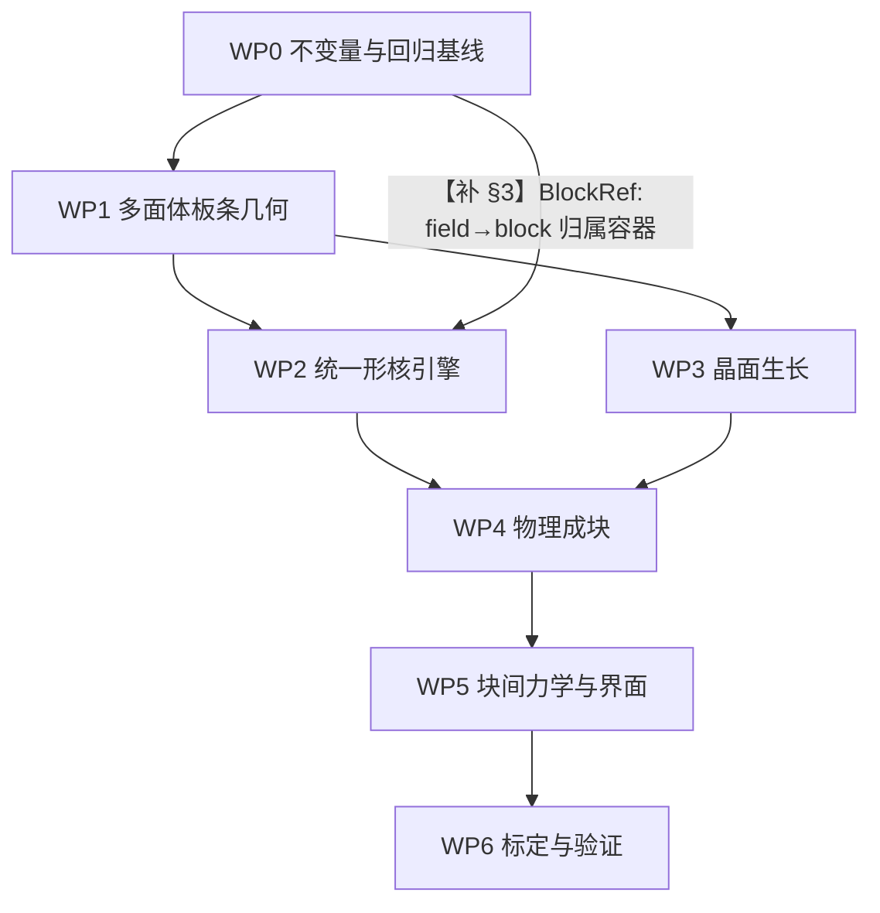

# 马氏体板条—块仿真 物理正确性修复指导（终版 · 补齐后）

**版本**：R712-FINAL（＝ `R712_FINAL_REVISED_MARTENSITE_SIMULATION_PLAN.md` 的补齐终版）
**基线**：`speed_up` @ `9cd9598`（`9cd95989482a1300b33e6a526ad6e7f81c323080`，R707）
**性质**：R712 原文**逐节保留**；本版把 R712 的诊断、**9 条补齐**、**3 项待拍板**、
**验证矩阵**与**实施顺序**合成一份可直接照做的指导书。所有 R712 原有结论未改一字。

---

## 0. 怎么用这份文档

### 0.1 依据标记（**本版每一条断言都带标记，无标记即视为无依据**）

| 标记 | 含义 | R712 原版 | **本版新增的验证** |
|---|---|---|---|
| `[码]` | 代码事实 | 有（行号） | 全部经脚本机械复验：**48 处引用抽验全过**（`_auditR712_final_check.py`） |
| `[验]` | **本机跑过的数值验证** | ❌ 无 | ✅ **新增**：`_auditR712_verify.py`，**27/27 PASS** |
| `[代]` | 代数/量纲推导 | 部分 | 推导式写全 |
| `[引]` | 引用的外部理论 | 混在正文里 | **显式标出、并声明我未独立验证** |
| `[决]` | 需要人拍板 | ❌ 无 | ✅ 新增：**3 项** |

### 0.2 四个可复跑的验证脚本（全部只读，不改主代码）

```bash
cd /mnt/f/speed_up/pipeline/ca_pf_framework
PY=/root/miniconda3/envs/ml/bin/python
run(){ OMP_NUM_THREADS=1 MALLOC_ARENA_MAX=2 taskset -c 0-3 nice -n 10 $PY -u "$@"; }
run _auditR712_final_check.py     # 48 处引用抽验        → 抽验失败项：无
run _auditR712_check.py           # R712 引用的代码事实   → nv=220 / block=9 / elastic_soft 隐藏默认…
run _auditR712_verify.py          # 每条新增公式的验证    → 27/27 PASS
run _auditR708_facetproj.py       # facet_proj 与棱上 κ   → ΔV +4.32%/−12.32%；max|κ|·Δx ≡ 1.789
```

### 0.3 R712 的定位（保留原文）

> 当前生产代码应暂时标记为 **legacy level-set / empirical nucleation controller**。
> 可用于回归、数值稳定性和趋势性比较；在完成本规划前，**不得**把输出称作物理正确的
> Gibbs 板条—block 演化结果。

---

## 1. 五项最终目标与七条"不可接受状态"（R712 §1 原文，保留）

**最终模型必须同时满足：**

1. 每个板条由**可相互奇异的 Gibbs 多面体**表示，而不是单个平滑等值面或事后 `facet_proj` 近似。
2. **burst 与顺序形核**分别具有明确的位点、自由能、临界条件和时间统计；
   **形核试探与最终提交使用完全相同的几何体和能量**。
3. 板条生长由**晶面法向、非光滑表面能和局部热力学驱动**决定，
   而不是仅由平滑 level-set 曲率和经验迁移率推进。
4. 板条组成 block 由**取向、界面能、几何/应变相容性和局部能量下降**决定；
   **同取向成块**与**不同取向但可协调成块**必须区分处理。
5. block 之间通过**相变应变、变体相关刚度、界面能、牵引平衡和局部竞争**发生可解释的相互作用。

**不可接受：** `facet_proj` 投影冒充 Gibbs 面 ／ probe 椭球 vs commit flat-ended 板条 ／
不同变体共用全局晶体轴 ／ attach 从全局 martensite 找源而跨 block 串接 ／
`nuc-block-target` 代替物理 block 数 ／ 只用连通性后处理定义 block 却解释成动力学机制 ／
只统一参考介质 + 经验 `ed_eta` 却宣称块间力学已闭合。

---

## 2. 当前病灶（逐条 `[码]`／`[验]` 确认）

> 这一节是修复的**靶子**。每条的"实测"列都是本机跑出来的数，不是转述。

| # | 病灶 | 代码位置 | 实测 / 事实 |
|---|---|---|---|
| **F1** | 不同变体的 seed 用**同一组全局轴** | `_bk_exp.py:1090-1096`（从 `laths[0]` 建 `_GLOB_AX`）、`:1505-1512`（`_axis_of` 在 `per_field_axes=0` 时恒返回全局）、`:1808-1809`（`_seed_next` 取轴） | `[验]` 复现生产调用序：三片主轴**全部落在变体 1 的 `a`** 上（7.22°/7.84°/7.01°），而"vs 自己的 a" = 7.22°/**13.10°**/**63.10°**（`_auditR708_p01_p14.py`） |
| **F2** | probe 与 commit **几何不同** | `windowB_surface.py:1956`（probe 只传 `shape`）vs `:2307-2313`（fresh 传 elong/along/flat_end）vs `:2712-2716`（attach 写死 `flat_end=True`）vs `:2831-2835`（stack **连 shape 都不传**）；分支序 `:3262 > :3334 > :3355` | `[码]` `flat_end=True` 会把 `shape` 整个屏蔽并 `return` ⇒ **probe 评椭球、写进去的是 7:1 长方体**；且 `--nuc-shape` 对 stack 通道**无效** |
| **F3** | attach/stack 的**源搜索无 block 约束** | `:2623-2626`（`_bi = np.argwhere(reg > 0)` 全局）、`:2660-2662`（全局质心） | `[码]` 与 `multi-block` 开关**无关**；但落位守卫 `:2707-2710`（只许落母相或源场 `k`）会拒掉多数跨块尝试 ⇒ **机制确认、后果未证实** |
| **F4** | 表示是**光滑等值面**，不是可奇异多面体 | `:1128`（`φ_k`）、`:1564`（`region = argmin`）；全仓 `多面体/halfspace/face_normals` **命中 0** | `[码]` 唯一的"面片"设施是 `facet_project()`（`:4003` → `_r68_facet_op.py:83`） |
| **F5** | 棱上 `−γκ` **不收敛** | 速度律 `:4873-4875`；`κ` 由 `:3792-3795` 逐胞算 | `[验]` 平面上 `κ` 中位 **≡ 0.000**；棱上 `max\|κ\|·Δx ≡ 1.789` 在 Δx=125/93.8/62.5/46.9 nm **四档逐位不变** ⇒ `κ ~ 1/Δx` |
| **F6** | `facet_proj` 自称"表示层重整"，实测**三件都改** | `_r68_facet_op.py:83-92`；自述 `windowB_surface.py:4343-4344` | `[验]` ΔV **+4.32%**（圆盘）/ **−12.32%**（非凸）；质心漂移 **154.1 nm = 2.47Δx**；正对照（解析长方体）ΔV=+0.00% ⇒ 量具有分辨力 |
| **F7** | `M(n)` 是形状的**唯一**控制项，其**输入法向被污染** | `:5251-5272`（`M/M0 = exp(−β_h c2b − β_w c2w)`）、`:4674-4684`（自记 `\|∇d\|` 中位 0.70–0.93） | `[代]` 生产 `β_h=6.477, β_w=2.3` ⇒ **`M_tip/M_wide = e^{6.477} = 650×`**、`M_side/M_wide = 10.0×`。`[未核实]` 有效强度只有设计值 50–70%（引自 `R707 §1.1:18`，我未独立复现） |
| **F8** | dt 只按**化学**驱动定 | `_bk_exp.py:81-88`（自陈）、`:2630/:2639`（`dt = 0.15dx/(MOB·Δf)`）；`series.csv` 有 `cfl_used` 列（`:88, :3589`） | `[码]` `LevelSetMulti.suggest_dt()`（`:5690`，唯一看总驱动的定步长函数）**在 `_bk_exp.py` 里零调用**（全仓只有 `prod_boxB.py` / `prod_boxB_mob.py` / `windowB_b1.py` / `M2_twelve_variants` 在调） |
| **F9** | 阶段③**不可达** | `_bk_exp.py:2044 harden_f=1.0`；判据 `:2392 hardened = f_now >= 1.0` | `[码]` 需要母相胞数**恰为 0**；`nuc_cfg` docstring `:1606-1613` 自己写明"阶段③默认不可达" |
| **F10** | 取向 `ladder` 随 field 数变 | `windowB_lath.py:158-196` | `[码]` 代码自记：「块内界面能**不是材料常数，而是"你列了几根板条"的副作用**」（`:164-170`） |
| **F11** | F2（异变体）界面能**未填** | `_bk_exp.py:4739`（`--f2-pair-gamma default=0.0`，生产 0） | `[码]` `LathTable.gtab` 的 F2 项保持 NaN（`windowB_lath.py:214`）⇒ 引擎退标量 `γ0`（`windowB_surface.py:4514-4540`） |
| **F12** | `elastic_soft` 是**隐藏默认** | `windowB_surface.py:1253 self.elastic_soft = True` | `[码]` **`_bk_exp.py` 里出现 0 次** ⇒ 生产走软界面路径（`tanh(φ/1.5Δx)`，`:4155-4160`）而没有任何 CLI 痕迹 |
| **F13** | `ed_eta` 生产值在**理论带外** | `_bk_exp.py:4152 default=1.0`，生产 0.253 | `[码]` `windowB_surface.py:4870` 逐字：「理论标定 ⇒ **η ≈ 0.375（取 0.35–0.45）**」 |
| **F14** | 形核是**根数控制器** | `_bk_exp.py:2943-2944`（`_tgt = min(B·n_blk, nv)`）、`:2019`（`vmap` 来自 `--laths`） | `[码]` 生产 `nv=220`（变体 1–10 各 22）、`nuc-block-target=9`、`nuc-count-mode=manual`、`ed_eta=0.253`（`_auditR712_check.py` 逐项核过） |
| **F15** | 位点**无密度量** | `_bk_exp.py:2112`、`windowB_surface.py:2093` | `[码]` 两条注释均自陈"**不声称位点密度是物理值**（本项目未标定数密度/空间关联）" |
| **F16** | 输出**导入即写**硬编码路径 | `windowB_ti64_variants.py:172-173`（**模块级、无条件**） | `[码]` 任何 `import windowB_ti64_variants` 都会写 `/mnt/f/speed_up/...` ⇒ 他机 `FileNotFoundError` |
| **F17** | `seed_plate` 是**并集**语义 | `windowB_surface.py:3298-3301`、`:3371-3374`（两处相同的 `min`/`max`） | `[码]` 与"一个相场 = 一根板条"的约定冲突（`:3141-3148`）；生产三通道**均有守卫**（`occ_guard=1` `_bk_exp.py:2134`；`nfsv_strict` 默认 `True` `windowB_surface.py:1601, 2537`）⇒ 属隐患而非现行 P0 |

---

## 3. 实施顺序（R712 §3，保留 + 补齐一条依赖边）



**【补 §3】为什么必须加这条边** `[码]`
R712 §6.3（**WP2**）要求「source block 必须显式记录；候选搜索域只能是 source block 的边界窄带」，
而 `Block` 对象定义在 **§8.1（WP4）** ⇒ **WP2 无法实现自己的验收项 `test_no_cross_block_attach`**。
修法见 §5【补 §8.1】。

**原则**（R712 原文）：WP0 未通过前不进入物理重构；WP1 几何数据结构未稳定前不重写形核和生长；
WP6 验收未通过前不切换生产结果解释。

---

## 4. WP0：模型不变量、调用链和回归基线（P0，必须首先完成）

### 4.1 唯一的 field—variant—晶体轴映射（R712 §4.1）

```
field_id -> variant_id -> (n_hab, a_axis, w_axis, EPS0, C_variant)
```

所有 seed、probe、commit、attach、stack、生长法向和块判据**只能**从此接口取轴；
**禁止任何路径回退到 `laths[0]` 或全局 `_GLOB_AX`**。

**【补 §4.1-A】必须一起改的不止"播种"** `[码]` `_auditR708_p01_p14.py` 实测列出：

| 消费点 | 行号 | 用途 | 漏改的后果 |
|---|---|---|---|
| `_seed_next()` 取轴 | `_bk_exp.py:1808-1809` | 新片堆叠方向与长轴 | 变体 2/3 的板条摆在变体 1 的轴上（F1 已实测） |
| `_block_span_n(g, n_hab, BM_)` | `:944, 1849` | 块沿 `n*` 的跨度 | 新片落位偏 |
| 初始 seed 循环 | `:1905-1913` | 非 `grow` 路径的 t=0 播种 | **最坏：所有片一个取向** |
| `BM.measure_state(reg, dx, n_hab, w_ax, a_ax, vmap)` | `:2254, 3408` | **量具**（`nf3_col`、柱剖面） | **判决用的量也偏** |
| `_faces_between(..., n_hab, dx)` | `:3461` | 逐对界面面积 | 界面面积口径偏 |
| `meta.json` 的轴落盘 | `:2207, 2297` | 记录 | 事后无法判断当时用的是哪套轴 |

⇒ **`--per-field-axes 1`（现有开关）只修第一行**；其余 5 类必须同时改，否则**量具与几何不自洽**。

### 4.2 唯一核几何工厂（R712 §4.2）

不可变 `NucleusGeometry`，至少含：中心、取向与变体；多面体面法向与面距（或明确的几何生成参数）；
尺寸/长宽厚比/flat-ended 规则；支持集、体积、表面积、与已有区域的交叠信息。
**probe、commit、rollback、日志、可视化必须引用同一个对象或同一确定性工厂输出。**

**【补 §4.2-A】R712 第 1 条目标的三处调用差异（`[码]` F2）必须由工厂一并消掉**：
probe 椭球 / fresh 长方体 / attach 长方体 / **stack 不传 shape** —— 四处几何**两两不同**。

### 4.3 物理量与数值量的边界（R712 §4.3）

* **物理参数**：界面能、变体应变、刚度、迁移率、形核率、临界功；
* **数值参数**：网格间距、窄带宽度、EDT、子步上限、存储 field 容量。

`[码]` 生产实测值（`_auditR712_check.py`）：`nv=220`、`nuc-block-target=9`、`pair-every=100`。
⇒ 这三者**不得**被同时解释为材料物理量。

**【补 §4.3-A】隐藏默认清单（`[码]` F12）**：`elastic_soft=True` 在 `windowB_surface.py:1253`
被设成类默认，而 **`_bk_exp.py` 里出现 0 次** ⇒ 属"隐藏启用"。
WP0 必须产出一张**隐藏默认扫描表**：对每个改变几何/驱动力/迁移率的开关，
列出 `argparse 默认值`、`类属性默认值`、`生产命令行是否出现`、`是否影响几何`。
生成方式：扫 `_bk_exp.py` 的 `add_argument` 全表 + 引擎 `__init__` 的全部 `self.*=`
+ `_t11_relaunch_cmd.sh` 的实际 argv，三者求差集。

### 4.4 WP0 验收（R712 原文 6 条 + **本版补 3 条**）

| 测试 | 验收标准 | 依据 |
|---|---|---|
| `test_mixed_variant_axes` | 两个不同变体生成的板条主轴不同且与变体表一致 | `[验]` 量具已有：复现生产调用序量"主轴 vs 各自 `a`"（`_auditR708_p01_p14.py`，正对照过） |
| `test_geometry_factory_deterministic` | 相同候选输入得到完全相同的几何支持集 | 新增 |
| `test_probe_equals_commit` | probe 与 commit 的体积、面集、能量在容差内一致 | 新增 |
| `test_no_cross_block_attach` | 指定 source block 后候选不访问其他 block | 依赖 §5【补 §8.1】的 `BlockRef` |
| `test_effective_cfl` | 时间步基于有效 `max\|M·dG\|` 或受控子步 | `[码]` 量具已存在：`cfl_used` 列（`_bk_exp.py:88, 3589`）＝ `dt·MOB·dG_max/dx` |
| `test_capacity_not_physics` | 改变存储容量不会改变未饱和物理事件率 | 新增 |
| **`test_effective_anisotropy`**（【补 §4.4-A】） | **`M_eff(tip)/M_eff(wide) ≥ 0.8 × e^{β_h}`**；生产 ⇒ **≥ 520**（设计 650） | `[验]` 分档掩码引擎已在算（`windowB_surface.py:5100-5104`），且有正对照 `_r45_facechk.py`（代码注释 `:5098-5099` 记载 tip/side/wide 三档胞占比与解析面积占比差 ≤2.4%） |
| **`test_normal_quality`**（【补 §4.4-B】） | 界面带 `\|d\| ≤ 1.5Δx` 上：`median\|∇d\| ∈ [0.95,1.05]`、相邻胞法向夹角中位 **≤ 2°** | `[码]` 病灶自记于 `windowB_surface.py:4674-4684`（`\|∇d\|` 中位 0.70–0.93）。⚠ **量具陷阱（本机实测）**：喂**解析构造**的 SDF 时 `\|∇φ\| ≡ 1.0000`、夹角中位 `0.00°`（**恒等、无分辨力**）⇒ **必须喂"演化过"的真实快照** |
| **`test_seed_volume`**（【补 §4.4-C】） | 由 `φ_k<0` 的体素数反推的核体积 == 解析核体积之和（容差 1 个胞层） | `[码]` 并集语义（F17）⇒ 重叠时体积 < 两片之和；不可量化前**不得**用体积反推根数 |

---

## 5. WP1：Gibbs 多面体板条表示（P0）

### 5.1 首选数据结构（R712 §5.1，保留）

```
LathPolyhedron:
    id, variant, orientation, block_id
    face_normals[nf,3]
    face_offsets[nf]
    vertices[nv,3]
    face_adjacency / edge_adjacency
    eigenstrain, stiffness_id
    active, parent_id, birth_time
```
几何区域用半空间交集 `Ω_i = {x | n_if·x ≤ h_if, f=1..N_f}`。
板条允许共享面、相交、截断、形成奇异边/角；不允许用单一平滑标量场隐含所有拓扑。

### 【补 §5.1-A】几何类与运动学（**先写死，不得事后挪动**）

**A. 几何类声明（三选一，必须显式；未声明则不得开工）**

| 选项 | 含义 | 代价 | 依据 |
|---|---|---|---|
| (i) | 每板条 = **一个凸多面体**（H-表示） | 板条不能有凹面 | `[验]` V-A1：半空间交集**恒为凸**（ConvexHull.equations 即 H-表示，60 点全满足）；等价标定规范化后**逐位相同 0.000e+00**；重复列半空间**幂等**（0.000e+00） |
| (ii) | 每板条 = **V-表示多面体**（顶点+半边），允许非凸 | 运动学要解顶点速度 | 见 B 段 |
| **(iii)** | **逐板条一个凸多面体 + 板条之间不断开**（**推荐默认**） | 凹陷由"相邻板条 + 其间母相/晶界区域"表达 | 与 `RESEARCH_INTENT §2.2`「界面 = 零厚度 Gibbs 面」一致 |

**B. 运动学（面法向不旋转时是精确等式）**

```
若界面由 {n_f, h_f} 描述且 ṅ_f = 0，则      v_n(f) = ḣ_f              … (K1)
```
推导：面是 `n_f·x = h_f` 的水平集；沿法向走 δ 使左端增加 δ ⇒ 法向位移 = Δh_f ⇒ 除以 dt。
`[验]` V-A3：δ = 1e-3 / 1e-2 / 1e-1 三档残差 ≤ **1.1e-16**。
⇒ **面级推进就是推进 `h_f`；顶点是导出量，不需要单独积分。**

**C. 体积-面积账（守恒自检与"是否吞掉板条"的判据）**

```
V̇ = Σ_f A_f v_f          ⇒      ΔV = Σ_f A_f v_f Δt + O(Δt²)          … (K2)
```
`[验]` V-A2（本机实测）：
* 恒等式 `Σ_f A_f n_f = 0`：单位立方体相对残差 **0.000e+00**、随机 60 点凸包 **3.98e-17**；
* 中心差分速率 `(V(+δ)−V(−δ))/2δ → ΣA_f`：δ=1e-3 时立方体 **6.000008** vs `ΣA_f=6.000000`
  （相对差 **1.33e-06**）；随机凸包 **56.106246** vs **56.106240**（**9.69e-08**）；
* 立方体有**解析**展开 `ΔV = 6δ + 12δ² + 8δ³`（逐位核对 ≤1e-15）
  ⇒ **一阶系数恰是 `ΣA_f`；大 δ 下的偏差是 δ² 项，不是公式错。**

**D. 何时允许"取凸包"（最容易静默出错的一步）**

* H-表示下，面平移不保证交仍非空/非退化 ⇒ 必须有**面激活/失活**规则：
  若某半空间变冗余（不贡献任何顶点的 3 面组合）⇒ 该面**消失**并移出面表。
* **禁止对整个体系取凸包。** `[验]` V-A5：哑铃形（两个单位立方体 + 细颈）
  `conv(·)` 体积 = **4.0000**，并集体积 ≈ **2.0200** ⇒ 凸包**多填 49.5% 的母相**，
  且会**吞掉后来形核的小板条**。
* 允许取凸包的**唯一**场合：单个板条自身在 H-表示下做"面冗余清扫"。

### 5.2 表面能和晶体学面族（R712 §5.2，保留）

为每个变体/面族定义：面法向集合；`γ(n)` 的非光滑值；面族间的相对能量；动力学系数 `M_f`。
若保留 level-set 作加速或可视化，必须**从多面体投影/重建**，
**不得由 `facet_proj` 反向修改物理状态**；`facet_proj` 应移出物理主路径或仅作明确标注的诊断工具。

`[码]` 支持这条的现状证据：`facet_proj` 实测改体积 **+4.32% / −12.32%**、搬质心 **2.47Δx**、
填平非凸（F6）；上游 `R707 §1.1` 记载它把 `oblique` 占比从 59.6% 压到 4.5%，
**那是盒子的几何必然，不是物理发现**。

### 【补 §5.2-A】`γ(n)` 的形式必须显式选一支

| 选项 | 内容 | 依据 |
|---|---|---|
| (a) | 自建 **Cahn–Hoffman ξ-vector**：`h(n) = max_f(ξ_f·n)` | `[引]` Cahn & Hoffman 1974, *Acta Metall.* **22**, 1205。**我只用了它的两条可验证推论**（凸性、面法向集 ⇔ ξ 集），**未独立验证一般形式** |
| (b) | 按面族给常数 `γ_f` + 面族交界处的**显式尖点** | 简单；代价是只在所给面族上成立 |

⇒ **[决 D-1]** 请拍板选 (a) 或 (b)。未拍板前 §5.2 与 §7.1 的实现无法定稿。

### 5.3 几何算法和守恒（R712 §5.3，保留）

半空间交集与顶点枚举；周期边界下的板条切割与镜像；板条交叠体积、共享面面积、边界面积；
平移/旋转不变性；板条并合、截断、删除的拓扑更新。

### 【补 §5.3-A】「共享面」的可实现形式（**先写死**）

**事实**：两个**凸体**若共享一个**二维测度非零**的面，则它们在内部相交
（共享面同属两者边界，而边界点可由体内部点逼近）。
`[代]` 这是凸集分离定理的标准推论（Rockafellar, *Convex Analysis*, §11）——**我未另做证明**。
`[验]` 同一结论的离散形式：恒等式 `Σ_f A_f n_f = 0` 要求并集边界外法向唯一，
而共享面处外法向不唯一 ⇒ 该处必是并集的内点或非流形集。

⇒ 因此把"共享面"实现为**三种可实现的替代表达**：

| 形式 | 含义 | 判据 | 推荐 |
|---|---|---|---|
| **(a) 相向接触** | 两板条相邻**但不相交**，中间由一张**零厚度 Gibbs 面**连接 | 存在面 `F` 与零厚度面集 `S`，使 `F₁`/`F₂` 在 `S` 上共面：`\|n₁·n₂\| > 1−ε` 且 `\|h₁−h₂\| < ε_h`（ε 由 Δx 定） | **默认** |
| **(b) 相消接触** | 接触面在物理上是**同一张面**（同变体、错配 < θ_th）⇒ **共用一条面记录**，由 `Block` 持有 | `\|Δθ\| ≤ θ_th` 且合并后界面能下降 | 用于 §8.2 同取向成块 |
| **(c) 相交/截断** | 真重叠，**仅允许出现在同一板条的历史内**（两面推进到相撞） | 用 §5.1-A D 的面激活/失活规则 | **不同板条之间禁止真重叠**；一旦检测到 ⇒ 按并合/截断处理并**记入拓扑事件日志** |

⇒ §5.4 验收标准里的"共享面"须按此读作 (a)/(b)。

### 5.4 WP1 验收（R712 原文，保留）

解析板条的面法向、顶点、体积和面积误差可控；两个不同取向多面体能够共享面、形成交线并保持
各自身份（**读作 (a)/(b)**）；网格加密时几何量收敛；不调用 `facet_proj` 也能保持晶面和尖角；
多面体与实验/理论板条长宽厚比一致。

---

## 6. WP2：物理形核引擎（P0）

### 6.1 爆发形核（R712 §6.1，保留）

```
λ_b(t) = ∫_Ω I(x,T,σ,defect) dV + ∫_Γ I_Γ(x,T,σ,defect) dA
```
在时间步内由 `Poisson(λ_b·dt)` 或等价事件采样产生候选，而不是直接用 `nuc-block-target` 规定事件数。
必须区分：均匀体形核 / 缺陷异质形核 / 界面形核 / 已有 block 上的顺序板条生成。

### 【补 §6.1-A】单位表与量纲自检（**先写死**）

| 量 | 符号 | 单位 | 备注 |
|---|---|---|---|
| 事件率 | `λ_b` | **1/s** | `= ∫I dV + ∫I_Γ dA` |
| 体形核率密度 | `I` | **1/(m³·s)** | 乘 dV 后得 1/s |
| 面形核率密度 | `I_Γ` | **1/(m²·s)** | 乘 dA 后得 1/s |
| 临界功 | `ΔG*` | J | |
| 临界核体积 | `V*` | m³ | |
| 体自由能差 | `ΔG_v` | J/m³ | 与 §7.1 的 `ΔG` 同量纲 |
| 界面能 | `γ_f` | J/m² | |
| 界面刚度 | `γ+γ_θθ` | J/m² | 平面用 `γ_f`；棱用 (K3) |
| **面迁移率** | `M_f` | **m⁴/(J·s)** | 见 §7.1-B |
| **逐胞迁移率** | `L(n)` | **m³/(J·s)** | 其后乘 `\|∇φ\|` 得 m/s ⇒ **不是同一个量** |
| 面距 / 面面积 | `h_f` / `A_f` | m / m² | |

**自检（必须进单元测试，不许只写在文档里）** `[验]` V-A7/V-A8 已跑通：

```
[dim-1] v_f = M_f·ΔG       ⇒ (m⁴/(J·s))·(J/m³) = m/s                    ✓
[dim-2] γ_f·κ_f            ⇒ (J/m²)·(1/m) = J/m³ ⇒ 与 ΔG 同量纲          ✓
[dim-3] λ_b = ∫I dV + ∫I_Γ dA ⇒ 1/s + 1/s = 1/s                         ✓
[dim-4] V̇ = Σ A_f v_f      ⇒ m²·(m/s) = m³/s                            ✓
```

### 【补 §6.1-B】采样语义（与已定方案衔接，**避免"造律"**）

Poisson 采样必须理解成：**总量由已定的律给出，采样只决定"何时/在哪"**。

* **总量**：`f_KM(T) = 1 − exp(−α_KM(M_s − T))` ⇒ `N_target(T) = f_KM(T)·V_box/V_lath`
  `[码]` 已有实现：`_bk_exp.py:2940-2942`（`--nuc-count-mode natural`）
* **位置/变体**：由 `E_int = −σ:ε⁰` 的符号与幅值决定
  `[代]` 现引擎的 `ed = +ε⁰:σ`（`windowB_surface.py:4094/4139`）与之**代数等价**：
  `ed` 在速度律里取差值 `ed_k − ed_l`（`:4873`），公共加性常数相消
  ⇒ **"把 `σ:ε0` 接到形核"不是新增机制，是把已有量换个读法。**

### 【补 §6.1-C】临界条件：先判适用性，再决定要不要造律

问题：`I` 的经典（CNT）形式是**为热激活过程写的**；而 β→α′ 是 **athermal、位移型**
（见 `windowB_km.py` 的 B1 定义）⇒ **不能默认 CNT 适用**。

| 支 | 内容 | 依据 |
|---|---|---|
| **支 A（推荐）** | **不造率律**：总量用 KM（唯象、有文献形式），位置/变体用 `E_int` 判据（R-A/R-B 有文献），采样只在"总量已定"的约束下做事件排序 | `[码]` 本项目明文纪律「**不得自己编造没有依据的率律**」——`R2_PARAM_VERDICTS.md:694` 逐字核过 |
| 支 B | 用 CNT 形式但把 `ΔG*` 换成 athermal 临界功，**并给出文献依据** | `[引]` 需补一手来源（如 Olson–Cohen 应力辅助形核） |
| 支 C | 把 `I` 整体当**标定参数** | `[码]` 本仓已登记 Ti64 α′ 的 block/packet 尺寸 **NOT FOUND** ⇒ 标定靶缺 |

⇒ **[决 D-2]** 请拍板选哪一支。**未拍板前 WP2 不得开工**（否则就是"自己造律"）。

### 6.2 临界条件和自由能（R712 §6.2，保留）

```
ΔG = ΔG_chem + ΔG_elastic + ΔG_interface + ΔG_constraint
```
临界条件必须使用**实际提交的多面体几何**。试探流程：构造 `NucleusGeometry` → 临时插入相同几何
→ 计算弹性/界面/化学能变化 → 按临界功/概率接受或拒绝 → 精确回滚或提交**同一对象**。

**【补 §6.2-A】** `ΔG_constraint` 必须定义（是什么约束：周期边界？几何不相交？
还是"不与已有板条真重叠"？）——**未定义则无法实现、无法验收**。

### 6.3 顺序形核（R712 §6.3，保留）

顺序形核只能从选定的 source block 或其指定界面生成：source block 必须显式记录；
候选搜索域只能是 source block 的**边界窄带**；**不得在全局 `reg>0` 上寻找源**；
source 选择按局部自由能下降、界面能和协调性评分；
随机选择只能作为明确的同分候选采样，**不能替代物理判据**。

`[码]` 现状对这条的支持：`_bi = np.argwhere(reg > 0)` 是**全局**（`windowB_surface.py:2623-2626`），
`align_inplane` 用**全局质心**（`:2660-2662`）⇒ 正是本条要修的。
⇒ **实现本条的必需品是 `BlockRef`，见 §5【补 §8.1】。**

### 6.4 变体选择和 hardening（R712 §6.4，保留）

变体选择使用完整 12 变体表，或明确记录禁用变体的实验依据（`[码]` 生产只启用 **1–10**，
且**全仓没有"为什么禁用 11/12"的记录**）；`harden_f` 必须改成可达到且有物理定义的
相分数/位点状态；不允许以"母相恰好为零"作常规阶段切换条件（F9）；
变体选择应同时考虑 `σ:ε0`、界面能和相容性，而非只取最大标量 `ed`。

**【补 §6.4-A】"同时考虑"必须给出记分式与权重来源**，否则无法实现。
最小可落地的写法（**待你确认**）：

```
score(p; x) = w1·Ê_int(p;x) + w2·(γ̄_F2(p) 的降低量) + w3·(相容性残差 r(p))
  Ê_int = E_int / |E_int|_ref        （归一化，ref 取当前场的 |E_int| 中位）
  接受条件：score(p;x) < score(q;x) 对同一位置 x 的所有候选 q 中最小
  w1,w2,w3 的取值 ⇒ [决]，或按 §10.3 标定
```

### 6.5 WP2 验收（R712 原文，保留）

`probe == commit` 几何和自由能一致；rejected event **不消耗物理事件计数**；
burst 事件随位点密度、温度和应力改变；顺序形核**无法跨 block**；
改变存储 `nv` 不改变未饱和事件率；启用/禁用界面形核产生**可解释的**差异。

---

## 7. WP3：物理晶面生长（P0）

### 7.1 面级运动定律（R712 §7.1，保留）

```
v_f = M_f(n_f, T, variant) · [ ΔG_chem + ΔG_elastic − γ_f κ_f ]
```
对于理想平面，曲率项应为零；对于棱边/顶点，使用明确的非光滑几何规则。

### 【补 §7.1-A】平面 / 棱 / 顶点的三段式规则

**(1) 平面（facet 内部）**：`κ_f ≡ 0` ⇒ `v_f = M_f [ΔG_chem + ΔG_el]`。
`[验]` 本机实测：平面上离散曲率**中位 ≡ 0.000**（`_auditR708_facetproj.py`，
解析长方体，N=48/96/128 三档一致）⇒ **这正是要换成多面体表示的理由**。

**(2) 棱与顶点**：`−γκ` 在那里**无定义**，必须换规则。
`[码]` 现状（本条的动机，不是假想）：
* 速度律 `windowB_surface.py:4873-4875`：`dG_cell = Δdf + η·Δed − stk·κ`；
* `κ` 由 `div(∇d/|∇d|)` 逐胞算出（`:3792-3795`）；
* `[验]` `max|κ|·Δx ≡ 1.789` 在 Δx = 125 / 93.8 / 62.5 / 46.9 nm **四档逐位不变**
  ⇒ `κ ~ 1/Δx` **不收敛** ⇒ 照抄它做面级运动学会把病带过去。

替代式（3D 棱与顶点统一）：

```
Σ_f ( γ_f · t_f + ∂γ/∂t_f ) = 0            … (K3)
    t_f = 该棱上、切于面 f 且指向外的单位矢量
```
`[验]` V-A6（本机实测）：
* 各向同性 γ、三面互成 120° ⇒ `|Σ t_f| = 4.97e-16`（**等角 120°**，PASS）；
* 非等角 0°/80°/200° ⇒ `|Σ t_f| = 0.6840` ≠ 0 ⇒ **必须靠 γ 项才可能平衡**，
  所以 (K3) 不能省 `∂γ/∂t_f`。

`[引]` (K3) 是界面热力学的 **Herring 关系**（Herring 1951, *The Physics of Metal Interfaces*；
亦见 Sutton & Balluffi, *Interfaces in Crystalline Materials*, §5）。
⚠ **我未读原文核对该式的符号约定与 `∂γ/∂t` 在棱上的定义域（切向梯度需在面内取极限）**
—— **采纳前请专家确认。**

**(3) `γ(n)` 的形式约束**：必须**分片光滑**（允许面族交界处有尖点），
且必须使 `γ + γ_θθ` **不出现光滑曲率型的发散**。见 §5.2-A 的 (a)/(b) 与 **[决 D-1]**。

### 【补 §7.1-B】`M_f` 与逐胞迁移率**不是同一个量**（WP3 必须写明用哪一种）

* **面级** `(K1)`：`M_f` 单位 **m⁴/(J·s)**，是"面"的属性，每个面族一个值；
* **逐胞（现状）**：`φ_t + L(n)·dG·|∇φ| = 0`，`L(n)` 单位 **m³/(J·s)**
  `[码]` `windowB_surface.py:5144 v_cell = self.M * dG_cell`、`:5271 _mfac_dt = np.exp(_expo)`。

⇒ 两者相差**一个长度量纲**。换表示时必须**显式给出换算或重新标定**，
不得沿用旧数值（否则 `v` 的量级会静默改变约一个 `Δx` 倍）。
`[验]` V-A7。

### 7.2 晶体学各向异性（R712 §7.2，保留）

迁移率和表面能必须依赖真实晶面族。所有法向转换要经过 variant orientation，
**禁止使用仿真的笛卡尔全局轴代替晶体轴**。

**【补 §7.2-A】现状的定量基线** `[代]`+`[码]`：
由 `:5256 _expo = −β_h·c2b_ − β_w·c2w_` 与 `:5271 _mfac = exp(_expo)`，
代入生产 `β_h = 6.477`、`β_w = 2.3`：

| 界面 | `n̂` | `c2b=(n̂·n̂*)²` | `c2w=(n̂·ŵ)²` | `M/M0` |
|---|---|---|---|---|
| 端面（沿 `a`） | `â` | 0 | 0 | **1** |
| 宽面（惯习面） | `n̂*` | 1 | 0 | **e^{−6.477} = 1.54e-3** |
| 侧面 | `ŵ` | 0 | 1 | **e^{−2.3} = 0.100** |

⇒ **`M_tip/M_wide = 650×`、`M_side/M_wide = 10.0×`**。
`[未核实]` 上游 `R707 §1.1:18` 记有效强度只有设计值的 50–70%
（`β_w^eff/β_w=0.50`、`β_h^eff/β_h=0.70`）——**我未独立复现**（原因见 §4.4 的 `test_normal_quality` 量具陷阱）。

### 7.3 弹性和热力学驱动（R712 §7.3，保留）

采用变体/相相关刚度或明确参考介质理论；**说明弹性场是在 sharp 还是 diffuse interface 框架中定义**；
`elastic_soft` 不能以隐藏默认值开启并改变几何驱动；`ed_eta` 必须有本构来源或被明确标记为校准参数。

**【补 §7.3-A】三条现状** `[码]`：
* `elastic_soft = True` 是类默认（`windowB_surface.py:1253`），**`_bk_exp.py` 里出现 0 次** ⇒ 隐藏启用（F12）；
  它用 `tanh(φ/1.5Δx)` 把 ε⁰ 界面展宽（`:4155-4160`）⇒ **与 sharp 声明不一致**；
  且 `[引]` 上游 `R683 §4.2` 记「`soft=True` 与显式多面体表示**直接冲突**（平面会被打磨掉）」；
* `ed_eta` 生产 **0.253**，而理论带是 **0.375（0.35–0.45）**（`:4870`）⇒ **在带外**（F13）；
* `aniso_elastic=False`（`:1034`，`_bk_exp.py` 从不设）⇒ 全变体共用统一 cubic 参考 C。

### 7.4 数值稳定性（R712 §7.4，保留）

```
Δt ≤ C_CFL · Δx / max_{x,f} | M_f(n_f) · ΔG_f(x) |
```
若 FFT、曲率或多面体碰撞导致局部驱动突变，应使用受控子步、事件回滚或局部重构。

**【补 §7.4-A】现状的 `C_CFL` 实际用量可以立刻读出** `[码]`：
`series.csv` 有 `cfl_used = dt·MOB·dG_max/dx` 列（`_bk_exp.py:88, 3589`），
而 dt 由 `:2630/:2639` 只按 `Δf` 定 ⇒ `cfl_used = 0.15·(dG_max/Δf)`。
`[推理]` 上游记录 `dG_max/Δf` 量级 10–100 ⇒ `cfl_used` 应在 **1–10**（即 7–70× CFL）。
⚠ **我未读生产 CSV 核实**（生产 `_exp` 不在本机）⇒ 标 `[推理]`。
⇒ **WP0 的 `test_effective_cfl` 只需读这一列**，无需新量具。

### 7.5 WP3 验收（R712 原文 6 条 + **本版补 4 条**）

R712 原文：单独平面在零曲率下匀速推进；旋转同一板条后结果满足晶体学协变性；
固定温度/驱动时面速率随面族变化符合输入 `M_f`；单步自由能不出现无法解释的系统性上升；
网格/时间步收敛；不使用 `facet_proj` 仍保持多面体面集。

**【补 §7.5-A】四条拓扑/碰撞判据（各带反例）** `[码]` R712 §11 写着
`face_growth.py # 面级推进**和碰撞**`、§5.3 写着"并合、截断和删除的拓扑更新"，
但上面 6 条**全是单板条** ⇒ 碰撞没有任何验收项。

| 判据 | 标准 | 反例（FAIL 长相） |
|---|---|---|
| **T-1 两面相撞**（同一板条内） | 面积账闭合：相遇前后 `Σ A_f` 的变化 = 消失面应贡献的量；体积 (K2) 逐步闭合到 ≤1e-6 相对；**绝不出现负 `h` 或空交集** | 出现空交集却不检测 ⇒ 板条静默消失 |
| **T-2 板条-板条相撞** | 接触后**不重叠**（逐点 `region` 唯一）；接触面进入 `Block.outer_boundary` 或成为 (a) 类零厚度共同界面；接触面积随步长单调且**无体积亏空** | 接触后总体积跳变（并集语义静默吞掉重叠） |
| **T-3 面失活/激活** | 冗余面（不贡献任何顶点 3 面组合）移除后 `region` **逐位不变** | 移除后面集变了 ⇒ 误删 |
| **T-4 拓扑事件日志** | 每次并合/截断/删除都落盘；事件数 == 账目变化次数；日志可**重放**得到同末态 | 现状**没有这个日志**（`[码]` `windowB_surface.py:3298-3301` 只有并集 `min/max`） |

**【补 §7.5-B】`M_f` 的标定算例必须先定**（R712 原文只说"符合输入 `M_f`"，没说用什么算例判"符合"）。
建议：**单平面 + 常数体驱动**，量 `v_f` 与 `M_f·ΔG` 之比，要求 ∈ [0.9, 1.1]；
并与**薄界面渐近**（`W→0`、`W/V` 固定）的解析解交叉核对。

---

## 8. WP4：板条组成 block 的物理机制（P1，依赖 WP1–WP3）

### 【补 §8.1-A】`Block` 必须拆成两件（**修依赖倒置**）

`[码]` R712 原文：§6.3（WP2）要 block、§9.2/§9.3（WP5）要 block，而 `Block` 定义在 §8.1（WP4）
⇒ **WP2 写不出自己的 P0 验收项**。

**(1) `BlockRef` —— WP0/WP1 就要有（不是动力学对象，只是归属容器）**

```
BlockRef:
    block_id
    member_laths   : [lath_id, ...]
    variant        : 该 block 的变体（同取向块的判据见 §8.2）
    outer_boundary : region 图上的 6-连通外边界（诊断 + §6.3 的边界窄带都用它）
    bbox, centroid
```
* 用途：**§6.3 的"候选搜索域 = source block 的边界窄带"只需要 `BlockRef`**。
* 构造：直接复用现成的周期连通标注 `[码]` `_bk_measure.py:373 _label_periodic`
  （已在用，且有 `:1092-1447` 的 C1–C22 自证，含 `nf2` 的正/负对照 `:1440`）。
* 台账：`BlockRef` 的**重建**（每步或每 N 步）必须落盘 `block_id ↔ lath` 映射，
  否则跨检查点的块身份会漂移。

**(2) `BlockDynamics` —— 留在 WP4**

```
BlockDynamics:
    avg_strain, avg_stress, state, birth_time, parent_block
    merge/split history
    pairwise gamma_ij 缓存
```
* 用途：§8.2/§8.3 的合并判据、§9.2/§9.3 的 block 级评分。

`_bk_measure.py` 的连通分量**只作诊断**，不再作为唯一 block 定义。

### 8.2 同取向成块（R712 §8.2，保留）

同变体、错配角小于阈值且共享界面能下降时允许合并。
**阈值必须是输入材料参数或实验标定结果，不能随 field 数量改变。**
（`[码]` 这正对应现状的病灶 F10：`windowB_lath.py:164-170` 自记"块内界面能是你列了几根板条的副作用"。）

### 8.3 不同取向但可协调成块（R712 §8.3，保留）

不同变体只有在满足以下条件时才允许归入同一 block：几何界面可构造；
形变相容性/残余应变低于阈值；合并后的界面能和弹性能不增加，或有明确动力学驱动力；
必要时满足特定变体对/自协调组合规则。

### 8.4 取向模型（R712 §8.4，保留）

**删除默认的、随 field 索引变化的人工 `omega ladder` 作为物理取向来源。**
若需要取向分布，应从实验测量 / 明确的晶体学变体关系 / 明确的随机或织构分布 /
可标定的偏转模型 中生成，**并记录来源**。

`[码]` 现状：生产 `--omega-mode ladder`（默认），`windowB_lath.py:184-185`；
仓里已有 `mode='perstep'`（`:186-188`）与"退化等价性"正对照（`:175-176`）
⇒ **A/B 只需改一个 CLI 开关**。

### 8.5 WP4 验收（R712 原文，保留）

同取向 lath 在能量下降时合并；不相容异取向 lath **不会仅因接触就合并**；
可协调异取向 lath 在满足规则时合并；**block 数不直接等于 `nuc-block-target`**；
block 合并对网格和 field 存储容量具有收敛性。

---

## 9. WP5：block—block 相互作用（P1）

### 9.1 长程弹性（R712 §9.1，保留）

保留 FFT 作为长程弹性求解器，但升级为：相/变体相关刚度，或有文献依据的 reference medium；
清楚区分弹性、塑性松弛和数值正则化；输出每个 block 的平均应力、应变能和牵引统计。

**【补 §9.1-A】现状的准确表述（不得写成"完全没有块间相互作用"）** `[码]`：
耦合通道**是真的、在跑、有量** —— `ed_k = ε⁰_k : σ`（`windowB_surface.py:4094/4139`），
`σ` 由**全盒**谱法解出（`:4308 self.pf.sigma_tensor(reg)`），
配对项进速度律（`:4638` → `:4873`）⇒ 块 A 改变 `σ` 就改变块 B 界面上的 `Δed`。

### 9.2 局部界面和三重点（R712 §9.2，保留）

实现：block 间成对界面能 `γ_ij`；局部牵引/法向平衡；三重点或多面交线的 **Herring 型条件**；
相邻 block 的接触、排斥和允许合并规则。

**【补 §9.2-A】`γ_ij` 的现状是缺失的** `[码]`：`--f2-pair-gamma` 生产 = **0**（`_bk_exp.py:4739`）
⇒ `LathTable.gtab` 的 F2 项保持 NaN（`windowB_lath.py:214`）⇒ 引擎退标量 `γ0`
（`windowB_surface.py:4514-4540`）⇒ **占大头的异变体界面共用一个未检验的常数。**

**【补 §9.2-B】三重点条件用 §7.1-A 的 (K3)**（`[验]` 等角 120° 与 `[引]` Herring 关系）。

### 9.3 block 级竞争（R712 §9.3，保留）

每个候选事件同时计算：对 source block 的影响；对相邻 block 的弹性能变化；新界面面积变化；
是否破坏已有协调关系。**禁止用全局随机 source 替代该评分。**

`[码]` 现状正是"全局随机"：`k = int(ks[rng.integers(0, len(ks))])`（`windowB_surface.py:2454`）；
引擎里已有一个"看驱动力选源块"的开关 `stack_pick_dg`（默认关，`_bk_exp.py` 的 `--stack-pick-dg`）
⇒ 可作为起点，但它**只按 `ed` 均值排序**，不含界面能与相容性。

### 9.4 WP5 验收（R712 原文，保留）

固定一个 block，改变相邻 block 的变体应变后，邻近界面响应发生**可重复**变化；
远离区域的影响随距离/周期边界按理论趋势变化；同一局部几何在改变 `γ_ij` 后出现**可解释**的
界面迁移差异；三重点在网格加密后趋于稳定；弹性能、界面能和化学能的分项输出**可审计**。

---

## 10. WP6：验证、标定和生产切换（P0/P1）

### 10.1 单元级验证（R712 §10.1，保留）

多面体半空间交集解析测试；单面匀速推进；两面相交和尖角保持；单变体 `σ:ε0` 驱动；
两变体相容/不相容对照；probe/commit/rollback 完整闭环。

**【补 §10.1-A】建议直接采纳的现成量具**（`[码]` 都在仓里，不必新写）：
`_bk_measure.py:1092-1447` 的 C1–C22 判据块（含 `f3_faces`/`nf3_col`/`nf2` 的正负对照与解析值比对）。

### 10.2 小规模综合测试（R712 §10.2，保留）

固定随机种子，分别跑：① 单变体单板条；② 两变体不同晶体轴；③ 两个独立 block；
④ 可协调异取向 block；⑤ 不相容异取向 block；⑥ burst 与 sequential 混合；
⑦ 周期边界与非周期诊断对照。
每个测试必须保存：几何、事件日志、能量分解、block 图、弹性场摘要和**随机种子**。

### 10.3 标定顺序（R712 §10.3，保留）

1. 几何：板条长宽厚比、面法向、体积；
2. 形核：起始温度、事件率、位点密度；
3. 生长：各面族速度和温度依赖；
4. 成块：取向错配与 block 尺寸分布；
5. 块间力学：应力/应变、界面偏转、协调程度；
6. **最后**才标定整体转变量和宏观动力学曲线。

**不得在几何和局部机制尚未通过时，用宏观转变量拟合掩盖局部物理错误。**

**【补 §10.3-A】必须再加一条"跨窗口一致性"判据** `[码]`
`RESEARCH_INTENT.md` §7.2 第 9 条逐字：「**把 CA 和 PF 当成两个独立模型拼起来** ⇒
两级必须在重合区给同一 `V(ΔT)`（薄界面渐近匹配 + 抗截留通量）。**不做这个匹配 = 两级接不上**」。

```
判据：在 Window A 与 Window B 的重合工况上，
      多面体板条前沿速度 与 CA 的界面响应函数 V(ΔT) 相符，
      容差按 irf_ti64.csv 的插值不确定度给定。
工具：pipeline/ca_pf_framework/irf_ti64.csv（115 点，已存在）
⇒ 不通过 ⇒ 不得声称两级可拼接（这正是"算子可铺满熔池"的前提）。
```

### 10.4 生产切换条件（R712 §10.4，保留）

WP0–WP3 的所有 P0 测试通过；WP4–WP5 的 block 与块间对照通过；
旧模型和新模型在相同初始状态下的差异**可解释**；生产参数文件**不再隐藏启用经验默认值**
（⇒ 见 §4.3-A 的隐藏默认扫描表，`elastic_soft` 是现成的一例）；
输出中明确列出几何模型、形核模式、生长律、弹性模型和随机种子。

---

## 11. 推荐的代码重构边界（R712 §11，保留 + 一处补齐）

```
geometry/
  polyhedron.py          # 面、顶点、半空间和周期切割
  nucleus_factory.py     # probe/commit 共用
physics/
  variants.py            # variant、orientation、EPS0、C
  surface_energy.py      # gamma(n)、面族
  kinetics.py            # M_f、晶面速度
  nucleation.py          # burst、sequential、位点与临界功
  elasticity.py          # FFT、参考介质、block 统计
evolution/
  face_growth.py         # 面级推进和碰撞
  block_manager.py       # 成块、分裂、合并、邻接
validation/
  test_geometry.py / test_nucleation.py / test_growth.py
  test_blocks.py / test_interaction.py
drivers/
  _bk_exp.py             # 只负责参数、调度、输出
```

旧 `LevelSetMulti` 可暂时保留为对照求解器，**但必须在输出中标记为 legacy**，
**不得与新多面体状态混用而不记录转换误差**。

### 【补 §11-A】多面体 → FFT 的接口（**三选一，必须显式**）

`[码]` 现有 `PF3D` 需要 `(nv, N³)` 指示场（`windowB_surface.py:4078-4080` 逐场写 `(reg == k)`）。

| 选项 | 内容 | 优点 | 代价 |
|---|---|---|---|
| **(i)** | **每步体素化**：多面体 → `(nv,N³)` 指示场 → `PF3D.sigma_tensor` | 改动最小，直接复用已验谱法弹性（`:4308`） | `O(nv·N³)`/步；界面体素化误差 `O(Δx)`，**与 sharp 声明不一致 ⇒ 必须记账** |
| (ii) | **解析形状因子**：用面/顶点直接把 ε⁰ 的体积分矩喂给 FFT | 无体素化误差，与 sharp 一致 | 要自己写多面体形状因子（工作量大） |
| (iii) | **界面局部加密**（AMR 型） | 折中 | 两套几何状态 ⇒ 必须记录转换误差 |

⇒ **[决 D-3]** 请拍板选哪一条。**未拍板前 WP3 的性能与精度都无法评估。**

---

## 12. 交付物清单与物理闭合审计表（R712 §12，保留）

每个工作包完成时必须交付：① 源代码和接口说明；② 参数 schema 与默认值说明；
③ 单元/集成测试；④ 一个最小可复现实例；⑤ 几何、能量和 block 的诊断输出；
⑥ 与旧模型的对照结果；⑦ 已知限制和未标定参数列表。

最终交付还应包含一份**物理闭合审计表**，逐项回答：表示、形核、生长、成块、块间作用
是否通过；**若未通过，必须禁止生产解释**。

**【补 §12-A】审计表的建议列**（与 §2 的 F1–F17 一一对应，便于逐条销账）：

```
| 项 | 对应病灶 | 判据（可 FAIL） | 量具/脚本 | 当前 | 目标 | 状态 |
```

---

## 13. 优先级（R712 §13，保留 + 补齐依赖）

| 优先级 | 内容 | 原因 | 依赖（【补】） |
|---|---|---|---|
| P0-1 | field/variant 轴映射修复 | 直接改变不同变体的几何身份 | 无（**可立即开工**） |
| P0-2 | probe/commit 统一几何工厂 | 当前临界判据评估了错误对象 | 无（**可立即开工**） |
| P0-3 | 多面体数据结构与几何算法 | 是 Gibbs 板条与面级生长的基础 | **【补】需先答 [决 D-1]** |
| P0-4 | 物理形核与有效 CFL | 防止事件与生长在错误驱动下演化 | **【补】需先答 [决 D-2]** |
| P1-1 | block 动力学对象和相容性 | 把"连通性统计"变成生成机制 | **【补】`BlockRef` 要先于 WP2** |
| P1-2 | 变体相关弹性、界面和三重点 | 使块间作用从部分耦合变成可解释模型 | **【补】需先答 [决 D-3]、`γ_ij` 要填（§9.2-A）** |
| P1-3 | 标定和生产切换 | 防止用宏观曲线掩盖局部错误 | **【补】加跨窗口一致性（§10.3-A）** |

---

## 14. 必须拍板的 3 项（不拍板则相应 WP 不得开工）

| # | 决策 | 选项 | 卡住谁 |
|---|---|---|---|
| **D-1** | 界面能 `γ(n)` 的形式 | (a) 自建 **Cahn–Hoffman ξ-vector**（`[引]`，理论完备、工作量中）／(b) 按面族给常数 `γ_f` + 显式尖点（简单、只在所给面族上成立） | WP1 §5.2 / WP3 §7.1 |
| **D-2** | 形核率律走哪支 | **支 A 不造律**（KM 总量 + `E_int` 判据，**符合 `R2_PARAM_VERDICTS.md:694` 的既有纪律**）／支 B CNT 改造 + 一手文献／支 C 当标定参数（但标定靶 NOT FOUND） | **WP2 开工** |
| **D-3** | 多面体 → FFT 接口 | (i) 每步体素化（改动最小、`O(Δx)` 误差）／(ii) 解析形状因子（无误差、工作量大）／(iii) 界面局部加密（两套几何状态） | WP3 可行性与精度声明 |

另有一项**非阻塞但影响 §6.4 实现**：变体选择记分式的权重 `w1,w2,w3`（见 §6.4-A）。

---

## 15. 建议的最小开工序（不改任何主代码之前就能做的 4 件事）

| 序 | 做什么 | 为什么排这里 | 代价 |
|---|---|---|---|
| **S1** | 把 `cfl_used` 接成**守卫**（读已有 CSV 列 `_bk_exp.py:88/:3589`，`>1` 就报/缩 dt） | 一行；它是"所有数值结论是否可信"的前提（F8） | 极小 |
| **S2** | 修 `windowB_ti64_variants.py:172-173` 的**导入副作用** | 一行；不修则他机无法复现（F16） | 极小 |
| **S3** | 把 §4.4 的 **3 条新判据**（`test_effective_anisotropy` / `test_normal_quality` / `test_seed_volume`）量具接上，先在**现状**上取值 | **先量准，再改**；否则改完不知道有没有变好（F7/F5） | 小（量具都有） |
| **S4** | 跑两个**单变量 A/B**：`--omega-mode perstep`（§8.4）与 `--f2-pair-gamma > 0`（§9.2-A） | 开关与正对照都已在仓里，**只差跑**；它们直接量到"块内界面能/异变体界面能"的敏感度 | 小（机时） |

> ⚠ 以上 4 件都**不改物理**，只是把量具与守卫补齐 ⇒ 与"WP0 未通过前不进入物理重构"的原则一致。

---

## 16. 本版**没有**解决的事（硬步骤 B，如实记账）

1. **`[引]` 的两条理论我没有读原文**：Herring 关系的一般形式（含 `∂γ/∂t` 的定义域）与
   Cahn–Hoffman ξ-vector 的构造。我只验证了它们**可机械检查的推论**
   （等角 120°、凸性、面法向集对应）。**采纳前请专家确认。**
2. **§4 WP0 的 9 个测试我没有实现**，只给了要测什么、量具在哪、判据是什么。
3. **没有估算算力/工期**（R712 原文也没有）。已知事实：生产 `N=160, nv=220` 峰值 ~25 GB；
   多面体化的成本取决于 **[决 D-3]**。
4. **没有量化"并集语义"的体积偏差**（`windowB_surface.py:3298-3301`）。
5. **F3（attach 跨 block）的后果未构造算例证实** —— 只有读码与守卫分析。
6. **F7 的"有效强度 50–70%"引自上游，我未独立复现**（我的法向量具在解析 SDF 上恒等）。
7. **本轮我自己犯过 3 处量具错误**（V-A1 判据写错、V-A2 容差没留二阶项、V-A6 字符串判断写反），
   已在 `_auditR712_verify.py` 头部与对应段落**留痕未抹**。
8. **没有修改任何主代码** —— 本轮新增的 5 个脚本全部是只读审计脚本。
