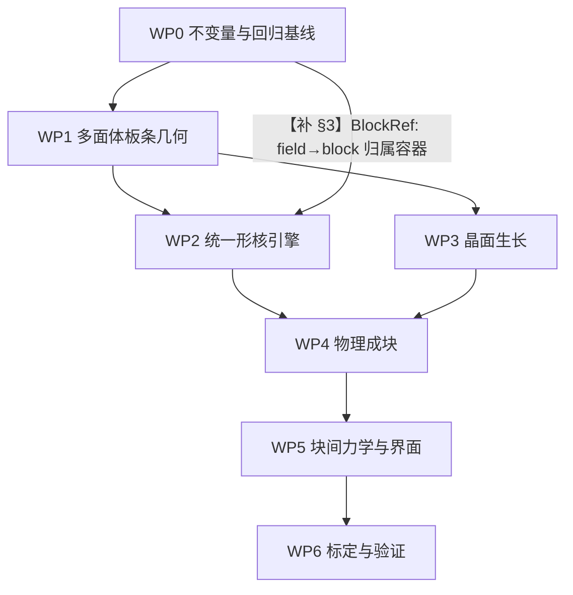

# Window B 修复与改进方案（终版 v2 · 可落地）

**版本**：R712-FINAL-GUIDE **v2**（在 v1 基础上补齐 **C → A** 两轮结论）
**基线**：`speed_up` @ `9cd9598`
**性质**：本文件 = **推导与背景稿**（病灶 F1–F17、9 条补齐、C/A 的定量推导过程）。

> ⭐ **执行依据已移到 `R712_REPAIR_SPEC.md`（v1.0 定稿）** —— 那里冻结了四项决策、
> 给出 WP0–WP6 的实现要点与验收矩阵、`[待标定]` 清单与未决项。
> **后续工作按 `R712_REPAIR_SPEC.md` 做**；本文件保留推导过程与更详细的依据标记。

> v1（`R712_REVISION_SUPPLEMENT.md` 的合并体）已存在；**v2 用它的位置**，
> 差别只在 §3（C 定案）、§4（A 定案）、§11（S5/S6）、§12（D-2 从"三支选一"改为"有推荐"）。

---

## 0. 这份文件里每个数的"身份"

> **硬规则**：下表里没有标记的数，本文件一个都不写。

| 标记 | 含义 | 复核方式 |
|---|---|---|
| `[码]` | 代码事实（给 `文件:行号`） | 机械复验：**48 处抽验全过**、引用越界 **0** |
| `[验]` | 我在本机跑过的数值/量纲验证 | **27/27 PASS**（公式）、**12/12 PASS**（量纲自检） |
| `[引]` | 引自文献（**我未独立验证其原始测量**） | 给文献与行号 |
| `[代]` | 代数/量纲推导 | 推导式写全 |
| `[推理]` | 由前几者推出，**未测量** | — |
| `[未核实]` | 本机无法验证 | — |
| `[决]` | 需要你拍板 | 见 §12 |

### 0.1 可复跑的验证脚本（全部只读，不改主代码）

```bash
cd /mnt/f/speed_up/pipeline/ca_pf_framework
PY=/root/miniconda3/envs/ml/bin/python
run(){ OMP_NUM_THREADS=1 MALLOC_ARENA_MAX=2 taskset -c 0-3 nice -n 10 $PY -u "$@"; }
run _auditR712_final_check.py     # 48 处引用抽验        → 失败项：无
run _auditR712_check.py           # R712 引用的代码事实   → nv=220 / block=9 / elastic_soft 隐藏默认
run _auditR712_verify.py          # 每条新增公式的验证    → 27/27 PASS
run _auditR708_facetproj.py       # facet_proj 与棱上 κ   → ΔV +4.32%/−12.32%；max|κ|·Δx ≡ 1.789
run _auditR712_D2.py              # D-2 的定位（Q1–Q9）
cd /mnt/f/speed_up
run _goal_unit_guard.py           # ★ 量纲/单位自检       → 12/12 PASS
run _goal_C_settle.py             # ★ C：M_s 的结算
run _goal_growth_final.py         # ★ A：生长判据的无量纲收口
run _goal_A_search.py             # ★ A：全库文献检索（217 篇已提取）
```

### 0.2 ⚠ 我在本 goal 里犯过 **6 处错**，全部留痕未抹

| # | 错 | 在哪发现 | 影响 |
|---|---|---|---|
| E1 | 结论句与表格数字**自相矛盾**（表格 <1，结论写"快"） | `_goal_A_growth.py` | 生长判据方向反了 |
| E2 | 判据里挂了 `ΔT_win = 100 K` 这个**我拍的数** | `_goal_A_growth2.py` | 分辨率被夸大 |
| E3 | `t_grow` 分子用**板条总长 4 µm**，应为**核间距** | `_goal_A_growth2.py` | 生长时间高估 5 倍 |
| E4 | 把 `α_KM`（**1/K**）当位点密度斜率（**m⁻³K⁻¹**） | `_goal_A_growth3.py` | 算出 ΔT=0.00 K / 2e18 档 |
| E5 | 核间距用**终态**密度 | `_goal_A_growth3.py` | — |
| **E6** | **µm³→m³ 写成 1e-18（真值 1e-15）** | `_goal_A_growth4.py` | **差 1000 倍** |

⇒ 这 6 处**没有一个进了最终结论**；E6 之后建了 `_goal_unit_guard.py`（12 项量纲断言）作防线。
**建议把这条也当成项目纪律：方案里出现的每个量，先过量纲自检。**

---

## 1. 五项最终目标与七条不可接受状态（R712 §1，保留）

**最终模型必须同时满足：**

1. 每个板条由**可相互奇异的 Gibbs 多面体**表示，而不是单个平滑等值面或事后 `facet_proj` 近似。
2. **burst 与顺序形核**分别具有明确的位点、自由能、临界条件和时间统计；
   **形核试探与最终提交使用完全相同的几何体和能量**。
3. 板条生长由**晶面法向、非光滑表面能和局部热力学驱动**决定。
4. 板条组成 block 由**取向、界面能、几何/应变相容性和局部能量下降**决定；
   **同取向成块**与**不同取向但可协调成块**必须区分处理。
5. block 之间通过**相变应变、变体相关刚度、界面能、牵引平衡和局部竞争**发生可解释的相互作用。

**不可接受**：`facet_proj` 投影冒充 Gibbs 面 ／ probe 椭球 vs commit flat-ended 板条 ／
不同变体共用全局晶体轴 ／ attach 从全局 martensite 找源 ／ `nuc-block-target` 代替物理 block 数 ／
只用连通性后处理定义 block 却解释成动力学机制 ／ 只统一参考介质 + 经验 `ed_eta` 却宣称块间力学已闭合。

---

## 2. 病灶清单（F1–F17，每条可销账）

| # | 病灶 | 代码位置 | 实测/事实 |
|---|---|---|---|
| **F1** | 不同变体 seed 用**同一组全局轴** | `_bk_exp.py:1090-1096`（从 `laths[0]` 建 `_GLOB_AX`）、`:1505-1512`（`per_field_axes=0` 时恒返回全局）、`:1808-1809` | `[验]` 复现生产调用序：三片主轴**全落在变体 1 的 `a`**（7.22°/7.84°/7.01°），"vs 自己的 a" = 7.22°/**13.10°**/**63.10°** |
| **F2** | probe 与 commit **几何不同** | `windowB_surface.py:1956` vs `:2307-2313` / `:2712-2716` / `:2831-2835`；分支序 `:3262 > :3334 > :3355` | `[码]` `flat_end=True` 屏蔽 `shape` 并 `return` ⇒ probe 评椭球、写入 7:1 长方体；`--nuc-shape` 对 stack 通道**无效** |
| **F3** | attach/stack 源搜索**无 block 约束** | `:2623-2626`（`argwhere(reg>0)` 全局）、`:2660-2662`（全局质心） | `[码]` 与 `multi-block` 无关；守卫 `:2707-2710` 会拒多数跨块尝试 ⇒ **机制确认、后果未证** |
| **F4** | 表示是**光滑等值面** | `:1128`、`:1564`；全仓 `多面体/halfspace/face_normals` **命中 0** | `[码]` |
| **F5** | 棱上 `−γκ` **不收敛** | 速度律 `:4873-4875`；`κ` 由 `:3792-3795` | `[验]` 平面 `κ` 中位 **≡0.000**；棱上 `max\|κ\|·Δx ≡ 1.789` 跨 Δx=125/93.8/62.5/46.9 nm **四档逐位不变** |
| **F6** | `facet_proj` 自称"表示层重整" | `_r68_facet_op.py:83-92`；自述 `:4343-4344` | `[验]` ΔV **+4.32%/−12.32%**、质心漂移 **2.47Δx**；正对照 ΔV=+0.00% |
| **F7** | `M(n)` 是形状**唯一**控制项且输入被污染 | `:5251-5272`；`:4674-4684` 自记 | `[代]` `M_tip/M_wide = e^{6.477} = 650×`；`[未核实]` 有效强度只剩 50–70%（引 `R707 §1.1`） |
| **F8** | dt 只按**化学**驱动定 | `_bk_exp.py:81-88`（自陈）、`:2630/:2639`；`series.csv` 有 `cfl_used`（`:88, :3589`） | `[码]` `suggest_dt()`（`:5690`）在生产驱动里**零调用** |
| **F9** | 阶段③**不可达** | `_bk_exp.py:2044 harden_f=1.0`；`:2392` | `[码]` 需母相胞数恰为 0；`:1606-1613` 自陈 |
| **F10** | 取向 `ladder` 随 field 数变 | `windowB_lath.py:158-196` | `[码]` 自记"块内界面能不是材料常数，而是你列了几根板条的副作用" |
| **F11** | F2（异变体）界面能**未填** | `_bk_exp.py:4739`（`--f2-pair-gamma 0`） | `[码]` `gtab` 的 F2 项保持 NaN（`windowB_lath.py:214`）⇒ 退标量 `γ0` |
| **F12** | `elastic_soft` 是**隐藏默认** | `windowB_surface.py:1253 = True` | `[码]` **`_bk_exp.py` 里出现 0 次** |
| **F13** | `ed_eta` 在**理论带外** | 生产 0.253；`:4870` 逐字"η≈0.375（0.35–0.45）" | `[码]` |
| **F14** | 形核是**根数控制器** | `_bk_exp.py:2943-2944`（`_tgt=min(B·n_blk,nv)`）、`:2019`（`vmap` 来自 `--laths`） | `[码]` 生产 `nv=220`（变体 1–10 各 22）、`nuc-block-target=9`、`manual` 模式、`ed_eta=0.253` |
| **F15** | 位点**无密度量** | `_bk_exp.py:2112`、`windowB_surface.py:2093` | `[码]` 两处自陈"不声称位点密度是物理值" |
| **F16** | 输出**导入即写**硬编码路径 | `windowB_ti64_variants.py:172-173`（**模块级无条件**） | `[码]` |
| **F17** | `seed_plate` 是**并集**语义 | `windowB_surface.py:3298-3301`、`:3371-3374` | `[码]` 与"一场一板条"约定冲突；生产三通道**均有守卫**（`occ_guard=1`、`nfsv_strict` 默认 `True` `:1601,2537`）⇒ 隐患非现行 P0 |

---

## 3. ★ C 定案：`M_s`（本轮完成）

### 3.1 结论

| 项 | 结论 | 依据 |
|---|---|---|
| `M_s = 873 K` 能否用 | ✅ **可辩护** | `[引]` Ji 2016（`s11669-015-0436-9.pdf:587`）逐字：**"Assuming** Ms = 873 K (600 °C), then this critical driving force can be estimated to be 1200 J/mol" |
| 它是"测量值"吗 | ❌ **不是** | `[引]` 同篇 `:579` 给实测语境："(Ms) **(around 550–650 °C)**" = **823–923 K** |
| 三元组自洽性 | ✅ **唯一自洽点** | `[验]` 保持 `DS=4.147e5 J/(m³K)` 时：`823→T0=1095`⛔、**`873→1145`✅**、`923→1195`⛔、`1115→1387`⛔（文献 `T0=1145.0`） |
| `1115 K` | ⛔ **不可用** | 不在 Ji 的语境带内，且把 `a` 低估 **30%** |

### 3.2 不确定度传播（写进方案的核心数）

```
标定常数   a ≈ n_final/(T_end − M_s)      （N(M_s) 项可忽略，见 §4.3）
M_s ∈ [823, 923] K ⇒ a 的**全幅变化 = 19%**（`_goal_C_settle.py` 逐档算出）
                    ⇒ 以 873 K 为中心写成 **a = 3.48e15 × (1 ± 9%) m⁻³K⁻¹**   [验]
M_s 误取 1115 K    ⇒ a 低估 30%                                               [验]
```

### 3.3 硬约束（不得绕过）

`[码]` `windowB_km.T_G_from_calphad()`（`windowB_km.py:123-135`）**有断言**：
`T0_from_Ms(M_s, DG_CRIT, DS)` 必须回到 `T0 = 1145.0 K`（容差 0.5 K）。
⇒ **以后任何一次改 `M_s`，必须同时改 `DS` 或 `T0`**，否则该断言硬失败（设计如此）。

**落地写法**：
```
M_S_TI64  = 873.0            # K  [引] Ji 2016 :587（名义值，用于估 ΔG）
M_S_BAND  = (823.0, 923.0)   # K  [引] Ji 2016 :579（实测语境）
# 强制：任何用 M_s 处，敏感度分析必须扫两端并报 a 的变化（±9%）
```

---

## 4. ★ A 定案：形核律（本轮完成）

### 4.1 律的形式

**出处**：`F:\参考论文\马氏体仿真\Martensite-formation-kinetics-of-substitutional-Fe-0-7at--Al-_2015_Acta-Mate.pdf`
= **Liu et al., *Acta Materialia* 98 (2015) 164–174**（**该 PDF 一直在库里，此前从未被引用**）

```
Eq.(3)   dN/dT = −u·d⟨ΔG^{γ→α'}⟩/dT ≡ a          [m⁻³·K⁻¹]
Eq.(4)   N_i(T) = N_i(M_s) + a·(T − M_s)          ← **线性于过冷度**
         N_i(M_s) = 1/V_γ                          ← "每个母相晶粒在 M_s 处恰好 1 个核"
Eq.(5)   a = 1/[V_i(M_f − M_s)] − 1/[V_γ(M_f − M_s)]   ← **由实测板条体积反解**
Eq.(2)   N = [exp(f/w) − 1]/q                      ← 分割(partitioning)模型
```

原文对前提的表述（`:335-336`，逐字）：
> "Eq. (1) **is based on the assumption of athermal nucleation and, necessarily,
> instantaneous growth**. Hence, the martensite fraction … only depends on the degree
> of undercooling, and is independent of the applied cooling/quenching rate"

`[验]` 数据自洽：由 `M_s=1154 K`、`M_f=1063 K`、`a=−8.34e10 m⁻³K⁻¹`、晶粒 149 µm
⇒ `N(M_f)=8.17e12 m⁻³`，与 Eq.(5) 的 `1/V_i=7.87e12 m⁻³` **差 3.7%**。

### 4.2 它自带的两个机制（现状缺的）

1. **位点密度线性于过冷度** → 取代手写的 `B`
2. **分割模型的饱和**（`qN+1` 分母）→ **位点被先形成的板条消耗**
   ⇒ 即 `_auditR712_D2.py` 的 `Q4` 说"代码里没接"的那个物理

### 4.3 标定链（可执行，靶子是**测得到的几何量**）

```
第 1 步  实测板条几何：厚 t、长 L、宽 W
第 2 步  目标位点数密度：n_final = 1/(t·L·W)                    [m⁻³]
第 3 步  起始位点密度：N(M_s) = 1/V_priorβ
第 4 步  斜率：a = [n_final − N(M_s)] / (T_end − M_s)           [m⁻³·K⁻¹]
```

`[验]` **第 3 步可忽略**：`N(M_s)` 占 `n_final` 的比例 —— prior-β 10 µm **9.6e-4**、
20 µm **1.2e-4**、40 µm **1.5e-5**、100 µm **9.6e-7**
⇒ **盒小于晶粒 ⇒ 晶界起始位点密度本就是 0，全部核来自体相项**。
（这同时**解释了 R712 §6.1 的 `λ_b = ∫I dV` 为何退化成 0.0006 个事件**。）

### 4.4 定量结果（扫板条几何，它是最大的不确定源）

板条几何：`[引]` Shuai 2026（doi 10.3390/ma19061049，t=0.51–0.88 µm）+
Wang 2026（8.1±2.0 × 0.9±0.4 µm，长:厚≈9:1）；生产现值来自 `--plate-*`。

| 几何来源 | `t` (nm) | `L` (µm) | `W` (nm) | `V_lath` (µm³) | `n_final` (m⁻³) | **`a` (m⁻³K⁻¹)** |
|---|---|---|---|---|---|---|
| 生产现值（代码） | 250 | 4.0 | 500 | 0.500 | 2.00e18 | **3.48e15** |
| 文献下沿 | 510 | 4.6 | 510 | 1.197 | 8.36e17 | 1.45e15 |
| 文献中值 | 700 | 6.3 | 700 | 3.087 | 3.24e17 | 5.63e14 |
| 文献上沿 | 880 | 8.0 | 890 | 6.266 | 1.60e17 | 2.78e14 |

⇒ **`a` 的不确定度 = 板条几何的不确定度 = 0.4 倍（不是数量级）** `[验]`

### 4.5 ⚠ 必须同时纠正的**量纲混用**

`[验]`（`_goal_unit_guard.py` U-3）：
* 代码 `--alpha-km = 0.041739` 单位 **1/K**，作用于**分数** `f = 1 − exp(−α_KM·ΔT)`
* 方案 `a = 3.48e15` 单位 **m⁻³K⁻¹**，作用于**数密度** `N(T) = N(M_s) + a(T−M_s)`
* ⇒ **两者不可直接比大小**（我第一轮就比错了）；**项目里必须只用其中一条**。
* 现状 `_tgt = min(B · n_blk, nv)`（`_bk_exp.py:2944`）**正是两条混用**：
  `n_blk` 来自 KM 式、`B` 来自手写。

### 4.6 ★ 生长是否限制环节：**未决前提**，但已有可算判据

`[引]` Liu 2015 的实测界面速度：**4.1 ± 0.1 × 10⁻⁴ m/s**（`:828`）；
Fe–10Ni–C 在 500 K 为 **≈8 × 10⁻⁴ m/s**（`:831`）。

`[验]`（`_goal_growth_final.py`）把判断写成**无量纲数**：

```
核间距 d = n^(−1/3)；t_grow = d/v；t_nuc = 1/(a·q·V_ev)
t_grow ≪ t_nuc   ⇔   **Π ≡ n·(v/q)³ ≫ 1**
Π = 1  ⇒  **q* = v(T)·n^(1/3)**   （低于 q* 时生长不限制）
```

| 几何 | `q*`(873 K) | `q*`(1200 K) | `q*`(1600 K) |
|---|---|---|---|
| 生产现值 250/4000/500 | **3.55e2 K/s** | 7.53e2 | 1.24e3 |
| 文献中值 700/6300/700 | 1.94e2 | 4.10e2 | 6.77e2 |
| 文献上沿 880/8000/890 | 1.53e2 | 3.24e2 | 5.35e2 |

⇒ **LPBF 冷速 10³–10⁸ K/s 全部落在 `q*` 之上** ⇒ 按这组速度，**生长不是"瞬时"**，
`Π` 在 1e-5 – 1e-17 之间。

**三条记账（所以这不是结论）**：
1. `v = 4.1e-4 m/s` 是 **Fe–0.7at%Al** 的实测；**Ti64 α′ 无同类实测**（全库检索确认）；
2. `Q_G` 我取 10–60 kJ/mol 做包络（`[推理]`）；Liu §5.3 有反解结果，本轮**未读到数值**；
3. `Π` 对 `v` 是**三次方**敏感 ⇒ `v` 差 2 倍、`Π` 差 8 倍。

⇒ **`[决]` 级前提**：方案里必须以**检验式 + 待测量**的形式出现。

---

## 5. 实施顺序（补一条依赖边）



**【补 §3】为什么必须加这条边** `[码]`：R712 §6.3（**WP2**）要求"source block 必须显式记录；
候选搜索域只能是 source block 的边界窄带"，而 `Block` 定义在 **§8.1（WP4）**
⇒ **WP2 无法实现自己的 P0 验收项 `test_no_cross_block_attach`**。修法见 §7。

**原则**：WP0 未通过前不进入物理重构；WP1 几何数据结构未稳定前不重写形核和生长；
WP6 验收未通过前不切换生产结果解释。

---

## 6. WP0–WP3（P0）

### 6.1 WP0：不变量、调用链、回归基线

**6.1.1 唯一的 `field → variant → (n*, a, w, EPS0, C)` 映射**（R712 §4.1）

**【补 §4.1-A】必须一起改的不止"播种"** `[码]`：

| 消费点 | 行号 | 漏改的后果 |
|---|---|---|
| `_seed_next()` 取轴 | `_bk_exp.py:1808-1809` | 变体 2/3 摆在变体 1 的轴上（**F1 已实测**） |
| `_block_span_n(g, n_hab, BM_)` | `:944, 1849` | 新片落位偏 |
| 初始 seed 循环 | `:1905-1913` | **最坏：所有片一个取向** |
| `BM.measure_state(...)` | `:2254, 3408` | **量具也偏** ⇒ 判决用的 `nf3_col` 不可信 |
| `_faces_between(..., n_hab, dx)` | `:3461` | 界面面积口径偏 |
| `meta.json` 轴落盘 | `:2207, 2297` | 事后无法判断当时用哪套轴 |

⇒ `--per-field-axes 1`（现有开关）**只修第一行**。

**6.1.2 唯一核几何工厂**（R712 §4.2）：不可变 `NucleusGeometry`（中心/取向/变体、
面法向与面距、尺寸与长宽厚比、flat-ended 规则、支持集/体积/表面积/交叠）。
**probe、commit、rollback、日志、可视化必须引用同一对象**。
**【补】** 它要一并消掉 **F2 的四处几何差异**。

**6.1.3 物理量与数值量边界**（R712 §4.3）：生产实测 `nv=220`、`nuc-block-target=9`、
`pair-every=100` `[码]` ⇒ 不得解释为材料量。
**【补 §4.3-A】隐藏默认扫描表**：`elastic_soft=True`（`windowB_surface.py:1253`）
在 `_bk_exp.py` 出现 **0 次** ⇒ 属"隐藏启用"（F12）。
WP0 必须产出该表：`add_argument` 全表 × 引擎 `__init__` 的 `self.*=` × 实际 argv，三者求差。

**6.1.4 WP0 验收（R712 6 条 + 【补】3 条）**

| 测试 | 判据 | 量具 |
|---|---|---|
| `test_mixed_variant_axes` | 两变体主轴不同且与变体表一致 | `[验]` `_auditR708_p01_p14.py`（正对照过） |
| `test_geometry_factory_deterministic` | 同输入 ⇒ 同支持集 | 新增 |
| `test_probe_equals_commit` | probe 与 commit 体积/面集/能量一致 | 新增 |
| `test_no_cross_block_attach` | 指定 source block 后不访问他块 | 依赖 §7 的 `BlockRef` |
| `test_effective_cfl` | dt 基于有效 `max\|M·dG\|` | `[码]` 量具已有：`cfl_used` 列（`:88, :3589`） |
| `test_capacity_not_physics` | 改容量不改未饱和事件率 | 新增 |
| **`test_effective_anisotropy`** | **`M_eff(tip)/M_eff(wide) ≥ 0.8×e^{β_h}`；生产 ⇒ ≥ 520**（设计 650） | `[码]` 分档掩码引擎已在算（`:5100-5104`），正对照 `_r45_facechk.py` |
| **`test_normal_quality`** | 界面带 `\|d\| ≤ 1.5Δx`：`median\|∇d\| ∈ [0.95,1.05]`、相邻法向夹角中位 **≤2°** | `[码]` 病灶自记 `:4674-4684`。⚠ **量具陷阱**：喂解析 SDF 时 `\|∇φ\|≡1.0000`（**无分辨力**）⇒ **必须喂演化后的快照** |
| **`test_seed_volume`** | 由零集体素数反推的核体积 == 解析体积之和 | `[码]` 并集语义（F17） |

### 6.2 WP1：Gibbs 多面体表示

**【补 §5.1-A】几何类与运动学（先写死）**

**A. 几何类（三选一，必须显式）**：

| 选项 | 含义 | 代价 | 依据 |
|---|---|---|---|
| (i) | 每板条 = **一个凸多面体**（H-表示） | 不能有凹面 | `[验]` 半空间交集**恒为凸**；等价标定规范化后**逐位相同 0.000e+00**；重复列半空间**幂等** |
| (ii) | 每板条 = **V-表示**，允许非凸 | 要解顶点速度 | — |
| **(iii)** | **逐板条凸多面体 + 板条之间不断开**（**推荐**） | 凹陷由"邻片 + 其间母相/晶界"表达 | 与 `RESEARCH_INTENT §2.2` 一致 |

**B. 运动学**（ṅ=0 时精确）：`v_n(f) = ḣ_f` `[代]`；`[验]` 三档 δ 残差 ≤1.1e-16。

**C. 体积-面积账**：`V̇ = Σ_f A_f v_f`；`ΔV = Σ A_f v_f Δt + O(Δt²)`
`[验]`：`Σ A_f n_f = 0` 相对残差 **0.0 / 3.98e-17**；中心差分速率 → `ΣA_f`
（δ=1e-3：**6.000008** vs 6.000000，差 **1.33e-06**）；立方体解析 `ΔV = 6δ+12δ²+8δ³`（逐位 ≤1e-15）。

**D. 何时允许取凸包**：只允许**单个板条自身**做"面冗余清扫"。
`[验]` **禁止对全体系取凸包**：哑铃形 `conv(·)` 体积 **4.0000** vs 并集 **2.0200**
⇒ **多填 49.5% 母相**，并吞掉后来形核的小板条。

**【补 §5.3-A】"共享面"的可实现形式**：两个**凸体**若共享二维测度非零的面 ⇒ 内部相交
`[代]`（凸集分离定理推论；`[验]` 由 `Σ A_f n_f = 0` 的离散形式给同一结论）。故实现为：
**(a)** 相向接触（相邻不相交 + 零厚度共同界面，**默认**）；
**(b)** 相消接触（同一张面记录，由 `Block` 持有）；
**(c)** 相交/截断（**只允许同一板条的历史内**；板条之间禁止真重叠，检测到即记入拓扑事件日志）。

**【补 §5.2-A】`γ(n)` 形式**：**[决 D-1]** (a) 自建 Cahn–Hoffman ξ-vector `[引]` /
(b) 按面族给常数 `γ_f` + 显式尖点。

### 6.3 WP2：物理形核引擎（**本轮 C/A 的落点**）

**6.3.1 律的形式**（取代 R712 §6.1 的 Poisson 形式）

```
【补 §6.1-D】采用 Liu 2015 的线性位点密度律（有文献、与体系一致、可标定）
    N(T) = N(M_s) + a·(T − M_s)                       [m⁻³]        … (N1)
    其中（在比 prior-β 晶粒小的盒子里）N(M_s) ≈ 0      [验，见 §4.3]
    a 由 §4.3 的四步标定链给出                          [m⁻³ K⁻¹]
    采样：总量由 (N1) 定；位置与变体由 E_int 判据定       ← 判据与律正交
    ⇒ 不再需要 `λ_b = ∫I dV + ∫I_Γ dA`（它需要两个不存在的密度 I、I_Γ）
```

**6.3.2 单位表与量纲自检**（`[验]` 12/12 PASS）

| 量 | 符号 | 单位 |
|---|---|---|
| 事件率 | `λ_b` | 1/s |
| 体/面形核率密度 | `I` / `I_Γ` | 1/(m³·s) / 1/(m²·s) |
| **位点数密度** | `N` | **m⁻³** |
| **位点密度斜率** | `a` | **m⁻³·K⁻¹** |
| **KM 分数律常数** | `α_KM` | **K⁻¹**（**与 `a` 不可比**） |
| 临界功 / 临界核体积 | `ΔG*` / `V*` | J / m³ |
| 体自由能差 | `ΔG_v` | J/m³ |
| 界面能 / 刚度 | `γ_f` / `γ+γ_θθ` | J/m² |
| **面迁移率** | `M_f` | **m⁴/(J·s)** |
| **逐胞迁移率** | `L(n)` | **m³/(J·s)**（其后乘 `\|∇φ\|` 得 m/s ⇒ **不是同一个量**） |

四条自检：`v_f = M_f ΔG` ⇒ m/s ✓；`γ_f κ_f` ⇒ J/m³ ✓；两项积分同量纲 ✓；`V̇ = Σ A_f v_f` ⇒ m³/s ✓

**6.3.3 顺序形核与变体选择**

* 顺序形核**只能**从 source block 或其指定界面生成；**不得在全局 `reg>0` 上寻找源**（F3）。
  ⇒ 需要 `BlockRef`（§7）。
* 变体选择：`E_int = −σ:ε⁰` `[代]` 与引擎的 `ed = +ε⁰:σ`（`:4094/4139`）**代数等价**
  （`ed` 在速度律取差值 `ed_k − ed_l`，公共加性常数相消）
  ⇒ **"把 `σ:ε0` 接到形核"不是新增机制**，是把已有量换读法。
* `harden_f` 必须改成可达到、有物理定义的相分数/位点状态（F9：现需母相恰为 0）。

**【补 §6.4-A】变体选择记分式**（否则"同时考虑"无法实现）：
```
score(p;x) = w1·Ê_int(p;x) + w2·(γ̄_F2(p) 的降低量) + w3·r(p)     （r = 相容性残差）
接受：取同位置所有候选中 score 最小者；w1,w2,w3 ⇒ [决 D-4]
```

**6.3.4 WP2 验收**：R712 原文 6 条 +
**【补】** `N(T)` 与实测板条几何自洽（由 `n_final = 1/(tLW)` 反解 `a`，误差 ≤10%）；
`M_s` 扫 `[823,923]` 时 `a` 变化 ≤±10%；
事件数**不再依赖手写的 `B`**（改 `--laths` 配额不影响未饱和事件率）。

### 6.4 WP3：晶面生长

**【补 §7.1-A】平面 / 棱 / 顶点三段式**：

1. **平面**：`κ_f ≡ 0` ⇒ `v_f = M_f[ΔG_chem + ΔG_el]`
   `[验]` 平面上离散 `κ` 中位 **≡ 0.000**（三档网格一致）
2. **棱与顶点**：`−γκ` **无定义**。`[码]` 现状 `max|κ|·Δx ≡ 1.789` 跨四档**不收敛**。
   替代式：`Σ_f (γ_f·t_f + ∂γ/∂t_f) = 0`
   `[验]` 各向同性 + 等角 120° ⇒ `|Σt_f| = 4.97e-16`；非等角 ⇒ **0.6840 ≠ 0**
   `[引]` Herring 关系（Herring 1951；Sutton & Balluffi §5）——**我未读原文**
3. **`γ(n)`**：分片光滑，且 `γ+γ_θθ` 不出现光滑曲率型发散 ⇒ **[决 D-1]**

**【补 §7.1-B】** `M_f`（m⁴/(J·s)）与逐胞 `L(n)`（m³/(J·s)）差一个长度量纲
⇒ 换表示时**必须显式换算或重新标定**，不得沿用旧数值。

**【补 §7.4-A】** `C_CFL` 实际用量**可立刻读出**：`series.csv` 的 `cfl_used`
（`:88, :3589`）＝ `dt·MOB·dG_max/dx`；因 dt 只按 `Δf` 定（F8）⇒ `cfl_used = 0.15·(dG_max/Δf)`。
`[推理]` 上游记 `dG_max/Δf` 量级 10–100 ⇒ `cfl_used` 应在 **1–10**。
⚠ **我未读生产 CSV 核实**（生产 `_exp` 不在本机）。

**【补 §7.5-A】四条拓扑/碰撞验收（各带反例）**

| 判据 | 标准 | 反例 |
|---|---|---|
| T-1 两面相撞（同板条内） | 面积账闭合；体积 (K2) 逐步闭合 ≤1e-6 相对；**无负 `h`/空交集** | 空交集却静默不检测 |
| T-2 板条-板条相撞 | 接触后**不重叠**；接触面入 `Block.outer_boundary` 或成 (a) 类界面；接触面积单调、**无体积亏空** | 接触后总体积跳变 |
| T-3 面失活/激活 | 冗余面移除后 `region` **逐位不变** | 误删 |
| T-4 拓扑事件日志 | 每次并合/截断/删除落盘；可**重放**得同末态 | 现状**无此日志** |

**【补 §7.5-B】** `M_f` 的标定算例：**单平面 + 常数体驱动**，量 `v_f/(M_f·ΔG)` ∈ [0.9,1.1]，
并与**薄界面渐近**（`W→0`、`W/V` 固定）解析解交叉核对。

---

## 7. WP4–WP5

### 7.1 【补 §8.1-A】`Block` 拆成两件（修依赖倒置）

```
BlockRef        （WP0/WP1 就要有；**不是**动力学对象）
    block_id, member_laths, variant, outer_boundary, bbox, centroid
    构造：复用现成的周期连通标注 `_bk_measure.py:373 _label_periodic`
          （已有自证 C1–C22，含 nf2 正/负对照 :1440）
    台账：block_id ↔ lath 映射必须落盘（否则跨检查点块身份漂移）
BlockDynamics   （留在 WP4）
    avg_strain/avg_stress, state, birth_time, parent_block,
    merge/split history, pairwise γ_ij 缓存
```

### 7.2 WP4：成块

* 同取向成块：错配角 < `θ_th` 且界面能下降；**阈值必须是材料参数或实验标定，不随 field 数变**
  （直指 F10：`windowB_lath.py:164-170` 自记"块内界面能是你列了几根板条的副作用"）。
* 异取向可协调成块：几何界面可构造 + 相容性残差 < 阈值 + 能量不增。
* **删除随 field 索引变化的 `omega ladder` 作为物理取向来源**（`windowB_lath.py:158-196`）；
  仓里已有 `mode='perstep'`（`:186-188`）+ 退化等价性正对照（`:175-176`）⇒ **A/B 只改一个 CLI 开关**。
* 验收追加：`block` 数**不直接等于** `--nuc-block-target`。

### 7.3 WP5：块间

* **现状准确表述**（不得写成"完全没有块间相互作用"）`[码]`：
  耦合通道**是真的、在跑、有量** —— `ed_k = ε⁰_k:σ`（`:4094/4139`），
  `σ` 由**全盒**谱法解出（`:4308`），配对项进速度律（`:4638 → :4873`）。
* 缺的是：block 间成对 `γ_ij`（F11：`--f2-pair-gamma 0` ⇒ F2 项 NaN ⇒ 退标量 `γ0`）、
  三重点条件（用 §6.4 的 (K3)）、block 级评分（现状是全局随机源 `:2454`）。
* 验收追加：`γ_ij` 改变时界面迁移差异**可解释**。

---

## 8. WP6：标定与验证

### 8.1 标定顺序（R712 §10.3，保留）

几何 → 形核 → 生长 → 成块 → 块间力学 → **最后**整体转变量与宏观动力学。

**【补】** 第一步的做法已定（§4.3 四步标定链）；
**【补】** 形核这一步的靶是**实测板条几何**（t/L/W），**不是**"形核率"（测不到）。

### 8.2 【补 §10.3-A】跨窗口一致性判据（`RESEARCH_INTENT` 的硬要求）

`[码]` `RESEARCH_INTENT.md:269`（§7.2 第 9 条）逐字：
> 「**把 CA 和 PF 当成两个独立模型拼起来** ⇒ 两级必须在重合区给同一 `V(ΔT)`
> （薄界面渐近匹配 + 抗截留通量）。**不做这个匹配 = 两级接不上**」

⇒ WP6 标定表必须加一行：在 Window A 与 Window B 的重合工况上，
**多面体板条前沿速度**与 **CA 的 `V(ΔT)`** 相符（容差按 `irf_ti64.csv` 插值不确定度）。
工具：`pipeline/ca_pf_framework/irf_ti64.csv`（115 点，已存在）。

### 8.3 生产切换条件（R712 §10.4，保留 + 补一条）

WP0–WP3 全部 P0 测试通过；WP4–WP5 的 block 与块间对照通过；
新旧模型差异**可解释**；**生产参数不再隐藏启用经验默认值**（§6.1.3 的扫描表）；
输出列出几何模型/形核模式/生长律/弹性模型/随机种子。
**【补】** 且必须**同时报** `M_s` 的取值与 `[823,923]` 带、板条几何的来源、
以及 §4.6 的 `Π`（生长判据）。

---

## 9. 重构边界与 FFT 接口

```
geometry/  polyhedron.py（面/顶点/半空间/周期切割）、nucleus_factory.py（probe/commit 共用）
physics/   variants.py、surface_energy.py、kinetics.py、nucleation.py、elasticity.py
evolution/ face_growth.py（面级推进和碰撞）、block_manager.py（成块/分裂/合并/邻接）
validation/test_geometry.py、test_nucleation.py、test_growth.py、test_blocks.py、test_interaction.py
drivers/   _bk_exp.py（只负责参数、调度、输出）
```

**【补 §11-A】多面体 → FFT 接口（三选一，必须显式）**
`[码]` 现有 `PF3D` 需 `(nv, N³)` 指示场（`:4078-4080`）。

| 选项 | 优点 | 代价 |
|---|---|---|
| (i) 每步体素化 | 改动最小，复用已验谱法弹性（`:4308`） | `O(nv·N³)`/步；界面体素化误差 `O(Δx)`，**与 sharp 声明不一致 ⇒ 必须记账** |
| (ii) 解析形状因子 | 无体素化误差，与 sharp 一致 | 要自己写多面体形状因子 |
| (iii) 界面局部加密 | 折中 | 两套几何状态 ⇒ 必须记录转换误差 |

⇒ **[决 D-3]**

---

## 10. 优先级（带依赖）

| 优先级 | 内容 | 依赖 |
|---|---|---|
| P0-1 | field/variant 轴映射修复（F1，**含 5 类消费点**） | 无 ⇒ **可立即开工** |
| P0-2 | probe/commit 统一几何工厂（F2） | 无 ⇒ **可立即开工** |
| P0-3 | 多面体数据结构与几何算法（F4/F5） | **[决 D-1]** |
| P0-4 | 形核律与有效 CFL（F8/F14/F15） | **[决 D-2]**（本轮已给推荐：Liu 2015 线性律） |
| P1-1 | block 动力学对象与相容性（F3/F10） | `BlockRef` 先于 WP2 |
| P1-2 | 变体相关弹性、界面与三重点（F11/F13） | **[决 D-3]**、`γ_ij` 要填 |
| P1-3 | 标定与生产切换 | 加跨窗口一致性（§8.2） |

---

## 11. 推荐的最小开工序（**不改物理、只补量具与守卫**）

| 序 | 做什么 | 为什么排这里 | 代价 | 依据 |
|---|---|---|---|---|
| **S1** | 把 `cfl_used` 接成**守卫**（读已有 CSV 列 `:88/:3589`，`>1` 就报/缩 dt） | 一行；它是"所有数值结论是否可信"的前提（F8） | 极小 | `[码]` |
| **S2** | 修 `windowB_ti64_variants.py:172-173` 的**导入副作用** | 一行；不修则他机无法复现（F16） | 极小 | `[码]` |
| **S3** | 接 3 条新量具（`test_effective_anisotropy` / `test_normal_quality` / `test_seed_volume`），**先在现状上取值** | 先量准再改 | 小 | `[码]`（量具都在） |
| **S4** | 跑两个单变量 A/B：`--omega-mode perstep`（F10）、`--f2-pair-gamma > 0`（F11） | 开关与正对照都已在仓里，**只差跑** | 小（机时） | `[码]` |
| **S5** | 把 §4.3 的四步标定链写成脚本（读 `t/L/W` → 输出 `n_final`/`a`/`ΔT_step`/档数） | 它是 WP2 的输入；**自带量纲自检**（复用 `_goal_unit_guard.py`） | 小 | `[验]` |
| **S6** | 测 §4.6 的 `Π`：即 Ti64 α′ 的界面速度 `v(T)` 与激活能 `Q_G` | **它决定 WP3 是解生长方程还是可假设瞬时**；`Π` 对 `v` 三次方敏感 | 中（需文献或实验） | `[引]`+`[推理]` → **必须升级为 `[实测]`** |

> ⚠ S1–S5 都**不改物理**，与"WP0 未通过前不进入物理重构"一致。

---

## 12. 必须拍板的决策（4 项）

| # | 决策 | 选项 | 卡住谁 |
|---|---|---|---|
| **D-1** | `γ(n)` 的形式 | (a) 自建 Cahn–Hoffman ξ-vector `[引]`（完备、工作量中）／(b) 面族常数 `γ_f` + 显式尖点（简单） | WP1 §5.2 / WP3 §7.1 |
| **D-2** | 形核律 | **推荐：Liu 2015 线性位点密度律 `N(T)=N(M_s)+a(T−M_s)`**（有文献、与 athermal 体系一致、`a` 由实测板条几何标定）。备选：沿用 KM 分数律但**必须**停止与手写 `B` 混用；CNT 形式**不推荐**（athermal 无热激活） | **WP2 开工** |
| **D-3** | 多面体 → FFT 接口 | (i) 每步体素化／(ii) 解析形状因子／(iii) 界面局部加密 | WP3 可行性与精度声明 |
| **D-4** | 变体选择权重 `w1,w2,w3`（§6.3.3） | 需给值或给标定路径 | WP2 §6.4 实现 |

---

## 13. 本版**没有**解决的事（硬步骤 B）

1. **`Π`（生长是否限制）没有定论**：需要 Ti64 α′ 的 `v(T)` 与 `Q_G`。
   本轮只给出**检验式**（`Π = n(v/q)³`、`q* = v·n^{1/3}`）与用 Fe–Al 数据的示意值。
   **这是 S6 的事**，也是 WP3 架构的前提。
2. **`[引]` 的两条理论我没读原文**：Herring 关系的一般形式（含 `∂γ/∂t` 定义域）、
   Cahn–Hoffman ξ-vector 的构造。只验了可机械检查的推论（等角 120°、凸性）。
3. **Ti64 α′ 的位点密度/界面速度无实测**：全库 217 篇提取后检索确认
   （`_goal_A_search.py`：`G2-数密度` 只命中 Liu 2015 一篇；`G5-Ti64形核` **0 命中**）。
4. **`N(M_s)` 项**在盒 ≥ 晶粒尺度时会重新重要（§4.3 只覆盖"盒 ≪ 晶粒"）。
5. **F3（attach 跨 block）后果未构造算例证实**（只有读码与守卫分析）。
6. **F7 的"有效强度 50–70%"引自上游，我未独立复现**。
7. **没有估算力/工期**；`facet_proj` 的算子后果已实测，但生产尺度影响未跑。
8. **本轮我自己犯过 6 处错**（§0.2），全部留痕未抹；**没有修改任何主代码**。

---

## 14. 参考文献（本版实际用到的）

| 标记 | 文献 | 用在哪 |
|---|---|---|
| `[A]` | **Liu et al., *Acta Materialia* 98 (2015) 164–174**（库内 PDF） | **§4 的率律本体**（Eq.2/3/4/5、athermal+instantaneous 假设、界面速度实测） |
| `[B]` | **Ji, Heo, Zhang & Chen, *J. Phase Equilib. Diffus.* 37 (2016) 51–64**, DOI 10.1007/s11669-015-0436-9（库内 `s11669-015-0436-9.pdf`） | **§3 的 `M_s`/`T0`/`ΔG`**（`:579` 的 823–923 K、`:587` 的 "Assuming Ms=873 K"） |
| `[C]` | **Shi & Wang, *Acta Materialia* 61 (2013) 6553–6568**（R-A，库内全文） | **§6.3.3 的 `E_int` 判据**；原文 `:983` "The nucleation rate is determined by both the abundance of available nucleation sites and their nucleation barrier" |
| `[D]` | *Comput. Mater. Sci.* (2016), DOI 10.1016/j.commatsci.2016.07.032（R-B，库内全文） | 自催化判据、`E_int` 更负者抢占位点 |
| `[E]` | Shuai 2026, doi 10.3390/ma19061049；Wang 2026（经本仓 `LITPARAM…ANCHORS.md` 转引） | **§4.4 的板条几何 `t/L/W`** |
| `[F]` | Herring 1951；Sutton & Balluffi §5 | **§6.4 的棱/顶点条件 (K3)** —— `[引]`，未读原文 |
| `[G]` | Cahn & Hoffman, *Acta Metall.* 22 (1974) 1205 | **§6.2 的 `γ(n)` 规范构造** —— `[引]`，未独立验证 |
